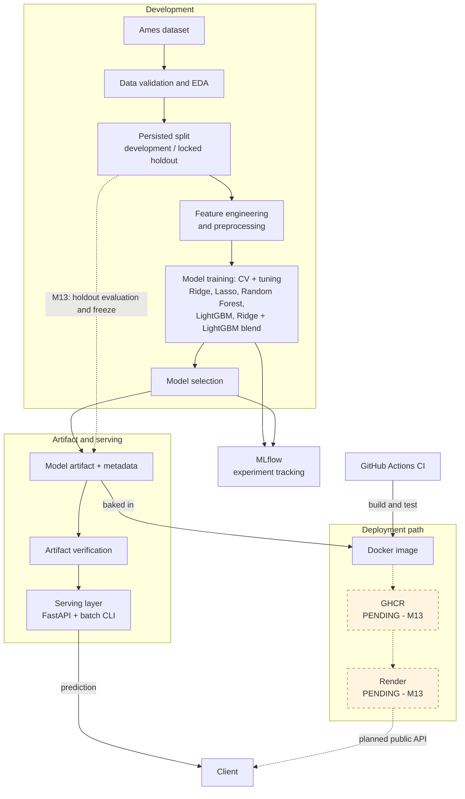
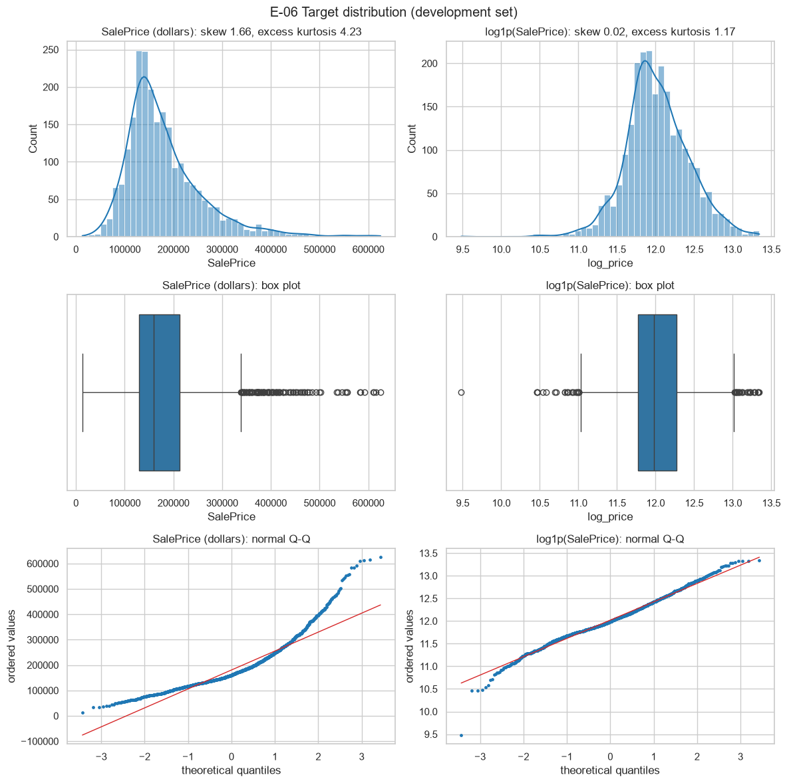
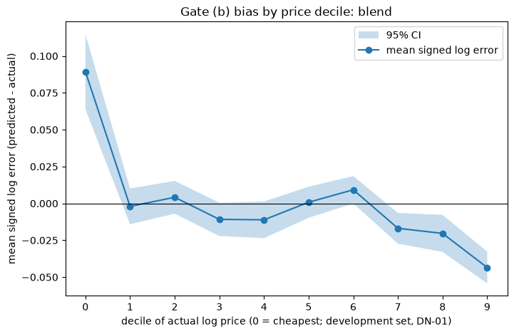

# House Price Prediction

An end-to-end, reproducible regression system that predicts residential sale prices from the full **Ames, Iowa Housing** dataset (De Cock, 2011). It covers the whole path from a raw CSV to a containerised prediction API: data validation, exploratory analysis, feature engineering, model comparison and tuning, a documented model-selection rule, hash-verified model artifacts, a FastAPI service, a batch CLI and a Docker image.

[](https://github.com/rniyati07/house-price-prediction/actions/workflows/ci.yml)


> **Current status (read this first).** Milestones M1–M12 are done. **The final holdout evaluation has not been run, no production model has been released, and nothing has been pushed to GHCR or deployed to Render.** Those steps are deliberately reserved for the M13 Release Run. All model numbers in this README are *development / repeated cross-validation* results, not final test performance. The model currently selected is a development choice; see [Limitations / Current Status](#limitations--current-status).

## Contents

[Overview](#overview) · [Key Features](#key-features) · [Architecture](#architecture) · [Dataset](#dataset) · [EDA Highlights](#eda-highlights) · [ML Pipeline](#ml-pipeline) · [Model Results](#model-results) · [Model Selection](#model-selection) · [Artifacts & Reproducibility](#artifact--reproducibility) · [FastAPI Serving](#fastapi-serving) · [Batch Prediction](#batch-prediction) · [Docker](#docker) · [Quick Start](#quick-start) · [MLflow](#mlflow) · [Project Structure](#project-structure) · [Testing & Quality](#testing--quality) · [Deployment](#deployment) · [Milestone Status](#milestone-status) · [Limitations](#limitations--current-status) · [Documentation](#documentation)

## Overview

| | |
|---|---|
| **Task** | Predict `SalePrice` (US dollars) of a residential property |
| **Data** | Full Ames Housing file: 2,930 rows × 82 columns (`data/raw/train.csv`, not committed) |
| **Modelling scope** | Homes with `GrLivArea <= 4000` → 2,925 rows; 77 model-input columns |
| **Target** | Model trained on `log1p(SalePrice)`; predictions are transformed back to dollars |
| **Primary metric** | Mean repeated-CV **log-RMSE** (relative error); MAE, MAPE and R² are reported as secondary metrics |
| **Serving** | FastAPI (`/health`, `/model-info`, `/predict`, `/predict/batch`) and a batch CLI, both loading the same verified artifact |
| **Packaging** | Two-stage, non-root Docker image with the model artifact baked in |

The design is specified in five documents (`docs/DOC-01` … `DOC-05`, see [Documentation](#documentation)); the code implements them milestone by milestone, and every deviation is recorded.

## Key Features

- **Fail-fast data contract.** One `configs/schema.yaml` generates the Pandera ingestion/inference schemas *and* the API's Pydantic request models, so training and serving cannot drift. The raw file is verified against a committed SHA-256 on every load.
- **Leakage-aware design.** A locked 585-row holdout, split once and persisted; transaction-outcome columns (`SaleType`, `SaleCondition`) excluded; the holdout can only be read by a single evaluation module (enforced by tests).
- **Fair model comparison.** Every candidate is scored on the same persisted 5×3 repeated stratified folds; selection uses a documented one-standard-error rule with model-family tiers.
- **Hash-verified artifacts.** Model + `metadata.json` (provenance, library versions, schema hash). The service refuses to start if the hash, library versions, schema, release flag or warm-up prediction check fails.
- **No duplicated preprocessing.** The API calls `pipeline.predict()` on a frame in schema order; a test enforces that `house_price.api` imports nothing from `features`, `pipelines`, `models` or `evaluation`.
- **Out-of-domain flagging.** Homes above 4,000 sq ft are priced but flagged `out_of_domain: true`, never silently clipped.
- **Structured logging.** One JSON log line per prediction request, an `X-Request-ID` on every response, and no raw property values in logs.
- **Reproducible container.** `uv.lock`-pinned dependencies, non-root user, health check, `PORT` support, one Uvicorn worker.

## Architecture

The end-to-end system on one page. Solid nodes exist and have been verified locally; **dashed orange nodes are pending and belong to the M13 Release Run**.



### Architecture at a glance

- **Development:** the raw Ames file is validated against `configs/schema.yaml`, explored, scoped to `GrLivArea <= 4000` and split once into a development set and a locked 585-row holdout.
- **Training and selection:** features and preprocessing feed repeated cross-validation and tuning of Ridge, Lasso, Random Forest, LightGBM and a Ridge + LightGBM blend, all on the development set; a documented one-standard-error rule picks the model (currently the blend).
- **Experiment tracking:** MLflow (local file store) records training and selection runs with lineage tags; GitHub Actions CI runs lint, type checks, tests, smoke training and the Docker test.
- **Artifact and serving:** the selected model is saved as one fitted pipeline plus `metadata.json`; it is verified (hash, library versions, schema, release flag) before the FastAPI service or the batch CLI loads it. Both share one 77-feature contract and return dollar prices with an `out_of_domain` flag. Today only the smoke (unreleased) artifact exists.
- **Deployment path:** a two-stage, non-root Docker image bakes in one artifact; CI builds and tests it but never pushes. The path Docker → GHCR → Render → client is the design for M13.
- **Pending (M13):** the single final holdout evaluation, final refit and freeze, the GHCR release push and the Render deployment have **not** happened; there is no live API yet.

## Dataset

| Fact | Value |
|---|---|
| Source | Ames Housing, compiled by Dean De Cock from the Ames Assessor's Office (*Journal of Statistics Education* 19(3), 2011). The file is **not** committed; see [Quick Start](#quick-start) |
| Raw shape | 2,930 rows × 82 columns, sale years 2006–2010 |
| Integrity | SHA-256 `65a1cbb8…44e4911`, committed in `configs/data.yaml` and checked on every load |
| Scope rule | `GrLivArea <= 4000` keeps **2,925** rows; 5 rows (Ids 1499, 1761, 1768, 2181, 2182) fall outside it |
| Identifiers | `Id` (loaded from the raw `Order` column) and `PID` are identifiers, never model features. Headers are normalised, e.g. `Gr Liv Area` → `GrLivArea` |
| Model inputs | **77** columns (27 are nullable) |
| Excluded | `SaleType`, `SaleCondition` (transaction-outcome variables, known only when a sale closes) |
| Split | **2,340** development / **585** locked holdout, seed 42, persisted in `data/processed/split_manifest.json` |
| Validation | Repeated stratified 5-fold CV × 3 repeats = 15 folds, shared by every model |

The project uses the full 2,930-row De Cock file rather than the 1,460-row Kaggle `train.csv` that parts of the original specification assumed. This is an owner decision documented in [`docs/data_card.md`](docs/data_card.md), and the configuration holds the resulting counts. Parsing treats only `NA` and the empty cell as missing, so the literal text `None` (e.g. in `MasVnrType`) remains a real category.

## EDA Highlights

Findings below are from the development set (`reports/eda/`, figures in `reports/figures/eda/`); they describe associations, not causes.

- **Target skew.** `SalePrice` skewness is ≈ 1.66; after `log1p` it is ≈ 0.02, which motivates modelling in log space.
- **Heteroscedasticity.** In dollars, residual spread in the top fitted-price decile is about 2.8× the bottom decile; on the log scale the ratio is about 0.75×.
- **Strongest numeric relationships** (by Spearman): `OverallQual`, `GrLivArea`, `GarageCars`, `YearBuilt`, `GarageArea`.
- **Neighborhood** is the most informative categorical (η² ≈ 0.59), followed by `BsmtQual`, `ExterQual` and `KitchenQual`.
- **Missingness is mostly meaning, not error.** About 96.3% of missing cells represent a feature that is absent (no pool, no alley, no garage…). `LotFrontage` and `Electrical` hold most of the genuinely unknown values. Houses with missing `LotFrontage` had a ≈ 10% higher median log price in the EDA analysis, so missingness indicators are kept.
- **No generic outlier deletion.** No IQR or z-score rule was adopted; the only exclusions are the 5 rows removed by the explicit `GrLivArea` scope rule.



The full EDA record is in [`reports/eda/E-35_eda_report.md`](reports/eda/E-35_eda_report.md); the notebooks in `notebooks/` regenerate the figures.

## ML Pipeline

```
raw 77-column input
→ semantic missing-value fill ("feature absent" columns)
→ feature engineering
→ model-family preprocessing
→ model
→ log-price prediction
→ expm1 (inverse transform)
→ dollar prediction
```

Everything above is one fitted `TransformedTargetRegressor` (`log1p` / `expm1`), saved as a single object, so serving needs no separate preprocessing code.

**Engineered features (12 approved formulas):** `TotalSF`, `TotalBath`, `HouseAge`, `RemodAge`, `IsRemodeled`, `TotalPorchSF`, `HasPool`, `HasGarage`, `HasBsmt`, `HasFireplace`, `Has2ndFlr`, `GarageAge`. A per-branch cross-validation ablation (M7) decides which are kept: the linear branch retains 7 of 12 and the tree branch 6 of 12 (`dropped_engineered` in `configs/features.yaml`).

**`GarageAge` data-validity correction.** The ablation diagnostics (M7) showed that a recorded `GarageYrBlt` later than `YrSold` (for example the year 2207 on a house sold in 2007) is impossible. Such values are therefore treated as *unknown* for `GarageAge`, like a garage with no recorded year, instead of producing a negative age.

**Model-family preprocessing** (configuration-driven, `configs/features.yaml`):

| Family | Used by | Steps |
|---|---|---|
| Linear | Ridge, Lasso | median imputation + missing indicators → Yeo-Johnson → `StandardScaler`; ordinal encoding/scaling; one-hot for nominal features |
| Tree | Random Forest, LightGBM | median imputation + missing indicators; ordinal handling; `OrdinalEncoder` for nominal features; no scaling or power transform |

**Candidates:** a `DummyRegressor` (median) and a 2-feature linear baseline as references; tuned Ridge, Lasso, Random Forest and LightGBM; and an equal-weight **Ridge + LightGBM blend** averaged in log-price space.

## Model Results

> **These are development / repeated-CV results (2,340 development rows, 15 folds). They are *not* final holdout or test performance. The final holdout result is not yet available.**

**M7 development checks** (reference settings, before tuning):

| Model | Mean CV log-RMSE |
|---|---|
| Ridge | ≈ 0.1125 |
| Lasso | ≈ 0.1152 |
| Random Forest | ≈ 0.1334 |
| LightGBM | ≈ 0.1161 |

**M8 tuned models and the M9 comparison** (`artifacts/cv_comparison/comparison.csv`, local):

| Model | Tier | Mean CV log-RMSE | SE | CV MAE ($) | CV MAPE (%) | CV R² |
|---|---|---|---|---|---|---|
| Dummy median (baseline) | – | 0.4083 | 0.0018 | 56,007 | 31.98 | −0.067 |
| 2-feature linear (baseline) | – | 0.1929 | 0.0020 | 24,775 | 15.01 | 0.807 |
| Ridge | 1 | 0.11251 | 0.00238 | 13,275 | 7.91 | 0.938 |
| Lasso | 1 | 0.11263 | 0.00231 | 13,182 | 7.86 | 0.938 |
| Random Forest | 2 | 0.12903 | 0.00289 | 15,175 | 9.01 | 0.914 |
| LightGBM | 3 | 0.11330 | 0.00260 | 13,017 | 7.81 | 0.938 |
| **Ridge + LightGBM blend** | 4 | **0.10931** | 0.00255 | 12,549 | 7.53 | 0.943 |

The log-RMSE differences between the leading models are small relative to their standard errors (≈ 0.002–0.003), which is exactly why selection uses an explicit rule rather than "lowest mean wins".

**Tuning budget deviation.** The canonical configuration specifies 30 Random Forest and 100 LightGBM Optuna trials. By an approved execution deviation, the M8 run used **15 and 30**. The configuration actually used is recorded in `artifacts/m8_execution_config/models.yaml` (local); `configs/models.yaml` still holds the canonical budgets. The tuned numbers above come from the reduced-budget run.

**Residual diagnostics of the selected blend** (out-of-fold, development set). The mean signed log error is within about ±0.02 for deciles 1–8, but the cheapest decile is over-predicted (≈ +0.09) and the most expensive under-predicted (≈ −0.04). This pattern is shown below and was part of the recorded human review:



## Model Selection

Selection is rule-based (DOC-03 §11, DN-04/DN-07/DN-08), recorded in [`reports/selection/selection_record.json`](reports/selection/selection_record.json) and checked by a human diagnostic review ([`diagnostic_review.yaml`](reports/selection/diagnostic_review.yaml)).

1. **Metric:** mean repeated-CV log-RMSE; SE = std(fold scores, ddof=1) / √15.
2. **One-standard-error rule with tiers:** among models within one SE of the best, prefer the simpler tier: Ridge/Lasso (1) < Random Forest (2) < LightGBM (3) < blend (4). Ties go to Ridge.
3. **Blend admission:** the blend is considered only if its mean beats the best single model's mean minus that model's SE.

Outcome: the best single model is Ridge (mean 0.112509, SE 0.002383), so the blend must be below ≈ 0.110125. The blend's mean is ≈ 0.109307, so it was admitted, and it was the only admissible model. **The selected development model is the equal-weight Ridge + LightGBM blend in log-price space.** The three diagnostic gates in the human review passed, and the review is marked final.

This is the *currently selected model*, chosen without touching the holdout. Whether it meets the final acceptance thresholds is **not yet known**.

## Artifact & Reproducibility

### Artifact system

Each artifact is a directory with `model.joblib` (the complete fitted pipeline) and `metadata.json` (a strict Pydantic model). Metadata records, among other fields: model version, `is_release`, model SHA-256, creation time, git commit and dirty flag, raw-data SHA-256, split-manifest hash, config hash, MLflow run IDs, Python and library versions, hyperparameters, transformed feature names, CV (and, for production artifacts, holdout) metrics, the 77-column input schema and its hash, the scope rule, the seed and the **artifact role**.

| Role | Purpose |
|---|---|
| `production` | The independently loadable artifact of the selected model; the only kind `freeze` can release and the service can serve |
| `candidate` | Post-selection reference refits of Ridge, Lasso, Random Forest and LightGBM for audit and learning. They carry no holdout-derived fields, are never released or served, and never influence selection |

`freeze` (not yet run for real) copies the staged artifact byte-for-byte to `models/x.y.z/` only after the release gates pass (quality gates, signed review, reproducibility check, clean tree, not a smoke artifact).

### Smoke artifact (not a release)

`artifacts/smoke/model` is produced by `train --smoke` / `evaluate --smoke` on a 200-row development sample with a holdout *substitute*. In the author's workspace it has `model_version = "unreleased"`, `is_release = false`, and SHA-256 `18bbe682559e98b8aeafd176936e2b5ca2d79bb799d688371f70d83eb93b0e7c`. It exists only to test the serving, CLI and Docker machinery; it is **not** the production model and its predictions mean nothing about real performance. A fresh smoke run on your machine writes its own artifact.

### How the experiment is reproduced

| Mechanism | Detail |
|---|---|
| Seed | 42 everywhere (split, folds, models) |
| Persisted split | `data/processed/split_manifest.json` (committed) records the IDs and hashes; the CSVs are regenerated and verified against it |
| Persisted CV folds | 15 folds in `artifacts/cv/folds.json` (local, git-ignored); never regenerated once written |
| Data integrity | Raw-file SHA-256 in `configs/data.yaml` |
| Pinned environment | Runtime dependencies pinned with `==` in `pyproject.toml` and locked in `uv.lock`; the Docker image installs `uv sync --frozen --no-dev` |
| Lineage | Every MLflow run is tagged with `pipeline_run_id`, `git_commit`, `git_dirty`, `data_sha256`, `split_manifest_sha256`, `config_hash` and `seed` |
| Artifact identity | Model SHA-256 and git SHA in `metadata.json`; library versions are re-checked at load |
| Reproducibility check | `python -m house_price.repro` (`make repro-check`) trains twice in isolated copies and compares results to a tolerance. **The full real-data check has not been run yet** |

`artifacts/`, `mlruns/`, `results/` and `models/` are git-ignored: they are produced locally by the pipeline. The committed evidence is under `reports/` (validation, EDA, selection record and review).

## FastAPI Serving

Start order: the service verifies the artifact and contract *before* it accepts a request. Any failed check stops the process.

| Method | Path | Purpose |
|---|---|---|
| `GET` | `/health` | Readiness: `{"status": "ok", "model_version": ...}` (not logged) |
| `GET` | `/model-info` | The loaded artifact's complete `metadata.json` |
| `POST` | `/predict` | One property → price |
| `POST` | `/predict/batch` | **1 to 20** properties, input order preserved, validated atomically |

**Request contract**

- All **77** model-input fields are required, using canonical names (e.g. `1stFlrSF`, not the raw header `1st Flr SF`). Identifiers, `SalePrice`, `SaleType` and `SaleCondition` are *not* accepted.
- The 27 nullable fields must be sent as an explicit `null` (`"PoolQC": null` means "no pool"); omitting a field is a 422.
- Strict types: integer fields accept JSON integers only; numeric fields reject strings and booleans; categoricals are closed, case-sensitive sets; unknown fields are rejected.
- Batch bodies are `{"properties": [...]}`; more than 20 or zero items → 422, and one invalid item rejects the whole request.

A complete 77-field example is in [`configs/api_example.json`](configs/api_example.json) (also the OpenAPI example and the start-up warm-up input). Shape of a call and response:

```http
POST /predict
Content-Type: application/json

{ "MSSubClass": 120, "MSZoning": "RL", "LotFrontage": 39.0, "PoolQC": null, "GrLivArea": 1616, ... }
```

```json
{ "predicted_price": 245621.72302666362, "model_version": "unreleased", "out_of_domain": false }
```

(The price above is what the unreleased *smoke* artifact returns for the example file; it is not a real model prediction.)

**Behaviour**

- `GrLivArea > 4000` is accepted, priced and flagged `out_of_domain: true`; the value is never clipped.
- Every response carries an `X-Request-ID` header. Validation failures are `422` with FastAPI's standard body; unexpected errors and prediction-guard violations (non-finite or non-positive price) are a generic `500` with `{"detail": "Internal server error", "request_id": ...}`, never a traceback.
- Each prediction request writes exactly one JSON log line (`prediction.completed`) with the request ID, endpoint, item count, an inputs hash, prediction, latency and model version, but never the property values.
- Startup refuses: a non-release artifact (unless `HPP_ALLOW_NON_RELEASE=true`), a candidate artifact (always), a SHA-256 mismatch, differing library versions, a schema-hash mismatch, a bad example file, or a failing warm-up prediction.

**Settings** (environment variables)

| Variable | Default | Meaning |
|---|---|---|
| `PORT` | `8000` | Port (Render supplies it) |
| `HPP_MODEL_DIR` | `/app/model` | Artifact directory |
| `HPP_CONFIG_DIR` | `/app/configs` | Config directory (needs `schema.yaml`, `api_example.json`) |
| `HPP_LOG_LEVEL` | `INFO` | Log level |
| `HPP_ALLOW_NON_RELEASE` | `false` | Lets a smoke artifact load; for CI and local tests only |

The model version is deliberately not a setting: it comes only from `metadata.json`.

## Batch Prediction

```powershell
$env:HPP_ALLOW_NON_RELEASE = "true"   # only needed for the unreleased smoke artifact
python -m house_price.cli predict --input tests/fixtures/consistency_rows.csv --output predictions.csv --model-dir artifacts/smoke/model --config-dir configs
```

`--model-dir` and `--config-dir` default to `HPP_MODEL_DIR` and `HPP_CONFIG_DIR`. The CLI uses the same verified artifact loading, prediction guard and out-of-domain rule as the API.

- **Input:** UTF-8 CSV with a header row. Either canonical names or the raw dataset headers (`Order`, `Gr Liv Area`, …) are accepted and normalised; only `NA` and empty cells are missing. The 77 model-input columns are required, in any order.
- **Columns:** `Id` and `PID` are copied to the output unchanged and never used for prediction; `SaleType`, `SaleCondition` and `SalePrice` are ignored (and logged); any other or duplicated column is rejected.
- **Size:** 1 to **20** rows per file (same limit as the API).
- **Validation:** lazy Pandera validation with the inference schema; the *whole file* is rejected if any row is invalid, with a full report (row, column, check, value).
- **Output:** `row_index`, `Id`/`PID` (if present), `predicted_price` (round-trip-exact, equal to the API's values), `out_of_domain`, `model_version`, in input order.
- **Exit codes:** `0` success · `2` invalid input (no output file written) · `3` runtime failure (artifact verification, prediction guard, …).

## Docker

The image (`Dockerfile`) is a **two-stage build**:

| Stage | Contents |
|---|---|
| `builder` (`python:3.12-slim`) | `uv` binary → `pyproject.toml` + `uv.lock` only → `uv sync --frozen --no-dev --no-install-project` (dependency layer, cached across code changes) → `src/` → install the package |
| `runtime` (`python:3.12-slim`) | `libgomp1` (OpenMP runtime LightGBM needs) → non-root `appuser` (UID 10001) → the venv, `src/`, `configs/` → the model artifact **last** |

- **Artifact baked in:** build args `MODEL_DIR` and `MODEL_VERSION`; one image holds exactly one model, and the OCI label `org.opencontainers.image.version` must equal `metadata.model_version` (the build script fails otherwise). Nothing is downloaded at runtime.
- **Runtime:** `EXPOSE 8000`, a Python standard-library `HEALTHCHECK` on `/health` that honours `PORT`, and `sh -c "exec uvicorn house_price.api.app:app --host 0.0.0.0 --port ${PORT:-8000} --workers 1 --no-access-log"` (one worker, no access log).
- **Contents:** only `.venv`, `configs`, `model` and `src`: no data, tests, notebooks, `.git`, or training/dev packages (MLflow, Optuna, pytest, Jupyter…). `.dockerignore` is an allow-list.

**Local verification (smoke artifact, image `house-price-api:unreleased`, ≈ 691 MB).** `python -m house_price.deploy test` checked that `/health` and `/model-info` respond; `/predict` works; the container also works with `PORT=10000` (as on Render); the server process runs as UID 10001 (not root); the example price was bit-identical between the container and a direct pipeline call on the host; a wrong `HPP_MODEL_DIR` makes the container exit with a `startup.failed` log line; and the image holds only the files listed above. A repeat build reuses the dependency layer.

> `house-price-api:unreleased` is a local smoke image for testing. It is not a release image, has not been pushed anywhere, and must never be deployed.

## Quick Start

Windows PowerShell. Requires Python 3.12 or newer (`.python-version` pins 3.12), Git, and optionally Docker Desktop.

**1. Get the code and create an environment**

```powershell
git clone https://github.com/rniyati07/house-price-prediction.git
cd house-price-prediction
python -m venv .venv
.\.venv\Scripts\Activate.ps1
python -m pip install -r requirements.txt
python -m pip install -e .
```

`pip install -e .` installs the package with the exactly pinned runtime versions from `pyproject.toml`. (The design documents describe `uv sync` from `uv.lock`; the repository's own `make setup` and CI use the pip commands above, and `uv.lock` is used by the Docker build.)

**2. Check the environment**

```powershell
python -m ruff check src tests
python -m mypy src
python -m pytest -q
```

Tests marked `data` are skipped automatically when the dataset is absent. The full suite takes roughly 15 minutes.

**3. Add the dataset.** The raw file is **not committed**. Place the full 2,930-row Ames/De Cock file at `data/raw/train.csv`. Its SHA-256 must equal `raw_sha256` in `configs/data.yaml`, otherwise loading stops with an integrity error.

**4. Validate the data and create the split once**

```powershell
python -m house_price.data.validate
python -m house_price.data.split
```

**5. Run the smoke pipeline.** A small, fast end-to-end run on a 200-row development sample with a holdout *substitute*. It never touches the real holdout and writes to `artifacts/smoke/` and the `hpp-smoke` MLflow experiment:

```powershell
python -m house_price.cli train --smoke
python -m house_price.cli evaluate --smoke
```

> Do **not** run `python -m house_price.cli evaluate` without `--smoke`: that is the one-time final holdout evaluation, reserved for the M13 Release Run.

**6. Start the API on the smoke artifact**

```powershell
$env:HPP_MODEL_DIR = "artifacts/smoke/model"
$env:HPP_CONFIG_DIR = "configs"
$env:HPP_ALLOW_NON_RELEASE = "true"
python -m uvicorn house_price.api.app:app --host 127.0.0.1 --port 8000 --workers 1 --no-access-log
```

**7. Open Swagger and make a prediction** (second terminal)

Open <http://127.0.0.1:8000/docs>, or:

```powershell
Invoke-RestMethod http://127.0.0.1:8000/health
Invoke-RestMethod -Uri http://127.0.0.1:8000/predict -Method Post -ContentType "application/json" -InFile configs/api_example.json
```

**8. (Optional) Docker, with the smoke artifact**

```powershell
python -m house_price.deploy build
python -m house_price.deploy test
```

**9. (Optional) MLflow UI** – see [MLflow](#mlflow).

If you have GNU Make, the same commands exist as targets: `make setup`, `make lint`, `make typecheck`, `make test`, `make validate-data`, `make split`, `make smoke`, `make serve`, `make predict`, `make docker-build`, `make docker-test`. (`make serve` and `make predict` choose the artifact via `MODEL_DIR`; for the smoke artifact pass `MODEL_DIR=artifacts/smoke/model HPP_ALLOW_NON_RELEASE=true`.) `make` is not installed on the author's Windows machine, so the targets themselves have not been executed there; the underlying commands have.

## MLflow

All runs use MLflow's **local file store** at `./mlruns` (git-ignored), with the standard lineage tags on every run. Experiments:

| Experiment | Contents |
|---|---|
| `hpp-baselines` | Dummy-median and 2-feature linear baselines |
| `hpp-ablation` | Per-branch engineered-feature ablation (M7) |
| `hpp-cv-comparison` | Cross-validated comparison of the candidates and the blend |
| `hpp-tuning` | Ridge/Lasso grids and Random Forest/LightGBM Optuna trials (M8) |
| `hpp-selection` | The selection record and diagnostic runs (M9) |
| `hpp-smoke` | Everything from `--smoke` runs |
| `hpp-evaluation`, `hpp-release` | Reserved for the real evaluation and release (M13); not populated yet |

Open the UI (the file backend is in maintenance mode in MLflow 3.x and needs an explicit opt-in):

```powershell
$env:MLFLOW_ALLOW_FILE_STORE = "true"
python -m mlflow ui --backend-store-uri ./mlruns
```

Then browse to <http://127.0.0.1:5000>. A local `mlruns/` exists only after you have run the pipeline yourself.

## Project Structure

```
.
├── configs/                 # schema.yaml (data contract), data/validation/features/models.yaml, api_example.json
├── data/
│   ├── raw/                 # train.csv (not committed)
│   └── processed/           # split_manifest.json (committed); dev/holdout CSVs are regenerated
├── docs/                    # DOC-01..DOC-05, data_card.md, deployment.md
├── notebooks/               # EDA notebooks that regenerate the figures
├── reports/                 # committed evidence: data_validation/, eda/, figures/, selection/
├── src/house_price/
│   ├── data/                # load, schema (Pandera), scope rule, split, validation report
│   ├── features/            # semantic fill and feature engineering
│   ├── pipelines/           # model-family preprocessing and pipeline builders
│   ├── models/              # registry, ablation, tuning, training, selection
│   ├── evaluation/          # CV, metrics, diagnostics, gates, the holdout reader
│   ├── persistence/         # artifact metadata, save/verify/load, freeze
│   ├── api/                 # FastAPI app, schemas, settings, logging, errors, prediction path
│   ├── cli.py               # train / evaluate / freeze / predict
│   ├── deploy.py            # Docker build, container test, GHCR push checks
│   ├── repro.py, tracking.py, results.py, config.py
├── tests/                   # unit/ and integration/ tests, fixtures/
├── artifacts/               # local outputs: folds, tuning, comparison, smoke artifacts (git-ignored)
├── Dockerfile, .dockerignore
├── Makefile
├── pyproject.toml, uv.lock, .python-version, requirements.txt
└── README.md
```

## Testing & Quality

| Check | Result at the M12 milestone |
|---|---|
| Full test suite | **610 passed** (3 tests that read the real holdout file to hash it are deliberately deselected in local runs) |
| Deployment tests (`tests/unit/test_deploy.py`) | 30 passed |
| `ruff check`, `ruff format --check` | clean |
| `mypy src` | clean |
| Coverage (`house_price`) | ≈ 93.4%, with an 80% minimum enforced |

Coverage fell from ≈ 95.0% (M11) because the Docker build/run code in `deploy.py` is exercised by real container verification, not by pytest. Coverage is a rough indicator, not a guarantee of correctness. The tests include a holdout-isolation check, a training–serving consistency test (API price equals direct `predict` exactly), Pydantic ↔ Pandera contract parity, startup-refusal cases, and the API import-boundary rule.

**CI** (`.github/workflows/ci.yml`): lint → typecheck → tests with coverage → smoke training on a committed synthetic fixture (CI has no dataset) → a Docker build-and-test job that downloads the smoke artifact, never logs in to a registry and never pushes. *The GitHub run of the Docker job has not been verified from the author's machine; check the CI badge above for the actual status.*

## Deployment

The release design (DOC-04 §12; full procedure in [`docs/deployment.md`](docs/deployment.md)):

1. Freeze the artifact to `models/x.y.z/`, then build and test the image locally.
2. Push `ghcr.io/<owner>/house-price-api:x.y.z` (tags are immutable; an existing tag is never overwritten; CI never pushes).
3. Deploy that exact image to a Render Web Service: Docker image runtime, health check `/health`, **auto-deploy off**, free tier, `HPP_LOG_LEVEL=INFO`, `PORT` set by Render, one worker. The model version comes from `metadata.json`, not from an environment variable.
4. Verify `/health` and `/model-info` over HTTPS; roll back by pointing Render at the previous known-good image tag.

Render does not build from the repository because `models/` is git-ignored; the image is built where the frozen artifact exists, and the tested image is the deployed image. `make docker-push` (`python -m house_price.deploy push --version x.y.z`) refuses smoke, non-release and candidate artifacts, an existing tag, and any run inside CI.

**Nothing here has been executed:** no release image exists, nothing is pushed to GHCR, and no Render service is created.

## Milestone Status

| Milestone | Scope | Status |
|---|---|---|
| M1 | Project foundation | Completed |
| M2 | Data ingestion and validation | Completed |
| M3 | Exploratory data analysis | Completed |
| M4 | Data preparation and feature engineering | Completed |
| M5 | Preprocessing architecture | Completed |
| M6 | Baseline modeling | Completed |
| M7 | Candidate model development | Completed |
| M8 | Hyperparameter tuning (reduced budget, see above) | Completed |
| M9 | Model selection and evaluation machinery | Completed (selection on the development set; holdout evaluation not run) |
| M10 | Final artifact creation machinery (production + candidate artifacts, `freeze`) | Completed (verified on smoke data only) |
| M11 | FastAPI serving layer and batch CLI | Completed |
| M12 | Dockerization and deployment preparation | Completed, committed and tagged `m12-complete`; verified locally with the smoke artifact |
| **M13** | Testing, documentation and the Release Run | **Pending** |

## Limitations / Current Status

- **No final holdout result.** The 585-row holdout has not been evaluated; no final RMSE, MAE, MAPE or R² exists. It will be used exactly once, in M13.
- **No production release.** There is no `models/x.y.z/`, no released model version and no production artifact. The only artifacts are smoke and local development artifacts (`unreleased`).
- **Selected model is provisional.** The Ridge + LightGBM blend was selected on repeated-CV results; whether it meets the project's final acceptance gates is not yet known.
- **Reduced tuning budget** (RF 15, LightGBM 30 trials instead of 30 and 100), an approved and recorded deviation.
- **Reproducibility check pending.** The full real-data check (AC-033, `make repro-check`) has not been run.
- **GHCR and Render:** no image has been pushed and no service exists. A live API URL does not exist.
- **GitHub CI:** the Docker CI stage has not been confirmed to be green from this repository state; check the badge.
- **Validity range:** the model is intended for Ames, Iowa, 2006–2010, homes up to 4,000 sq ft of living area. Larger homes are flagged, not trusted.
- **Serving scope:** no authentication, rate limiting, drift monitoring or frontend (accepted, documented scope limits).
- **Do not describe this project as production-ready** until M13 is complete.

## Future Work / M13

The M13 Release Run (DOC-05 §M13, DOC-04 §17) will, in order: run the reproducibility check; complete the human diagnostic review; run the single **final holdout evaluation** and quality gates; **refit** the selected configuration on all 2,925 rows; **freeze** the production artifact to `models/x.y.z/`; build and test the **release image**; push it to **GHCR**; deploy to **Render**; verify the live service; and publish the final documentation, model card and release notes.

## Documentation

| Document | Content |
|---|---|
| [`docs/DOC-01`](docs/DOC-01_Product_Requirements_and_Acceptance_Criteria.md) | Product requirements and acceptance criteria |
| [`docs/DOC-02`](docs/DOC-02_Data_Understanding_and_EDA.md) | Data understanding and EDA plan |
| [`docs/DOC-03`](docs/DOC-03_ML_System_Design.md) | ML system design (pipeline, selection, artifacts) |
| [`docs/DOC-04`](docs/DOC-04_Serving_and_Deployment_Design.md) | Serving and deployment design |
| [`docs/DOC-05`](docs/DOC-05_Implementation_Roadmap_and_Acceptance_Criteria.md) | Implementation roadmap and milestone acceptance criteria |
| [`docs/data_card.md`](docs/data_card.md) | Dataset source, known issues, scope rule |
| [`docs/deployment.md`](docs/deployment.md) | GHCR and Render deployment and rollback procedure |
| [`reports/eda/E-35_eda_report.md`](reports/eda/E-35_eda_report.md) | EDA report |

## License

No license file is included in this repository.
