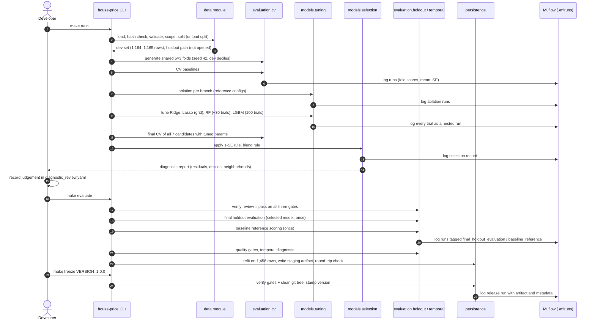

# DOC-03: ML System Design

**Project:** House Price Prediction — End-to-End ML Regression System
**Document ID:** DOC-03
**Version:** 1.0
**Status:** Approved baseline
**Date:** 2026-09-28
**Authoritative sources, in precedence order:** `house-price-prediction-adr.md` (ADR-000, ADR-01 to ADR-20) → DOC-01 v1.1 → DOC-02 v1.1
**Related documents:** DOC-04 Serving and Deployment Design

---

## How to Read This Document

DOC-03 is the implementation blueprint for the **training system**: everything from the raw CSV to a frozen, versioned model artifact. DOC-04 covers everything after that (serving, containerization, deployment).

**What this document does.** It turns the approved decisions into concrete components, data flows, configuration, stage order, and checks that an implementer can build directly. Every component cites its source: `[ADR-xx]` for architecture decisions, `FR-xxx` / `NFR-xxx` / `AC-xxx` for DOC-01 requirements, and `DOC-02 §x` for data understanding.

**What this document does not do.** It does not change any ADR decision, DOC-01 requirement or acceptance criterion, or DOC-02 property. It adds no tools, no model candidates, and no alternative validation or evaluation methods.

**Design notes (DN-xx).** Building a system needs details the ADR leaves open: for example, how many price bins are used for stratification, or the exact numeric ranges searched by Optuna. Where DOC-03 fixes such a detail, it is labelled **Design note (DN-xx)** and indexed below. The same principle as DOC-01's interpretation notes applies: *design notes implement ADR intent; they do not change ADR architecture.* If a design note ever conflicts with the ADR, DOC-01, or DOC-02, the higher-precedence document wins and the note is corrected.

**Design note index.**

| DN | Topic | What DOC-03 fixes | Section |
|---|---|---|---|
| DN-01 | Stratification bins | 10 quantile bins (deciles) of `log1p(SalePrice)` for the split and for CV folds | 5.7, 9.2 |
| DN-02 | Seeds | One global seed (42) in configuration; all random components receive it | 9.5 |
| DN-03 | Shared CV folds | Fold indices are generated once per training run and reused by every candidate, trial, and ablation | 9.2 |
| DN-04 | Standard error | SE = sample standard deviation of the 15 fold scores ÷ √15 | 11.3 |
| DN-05 | Ablation procedure | Ablation runs before tuning, with fixed reference configurations, and decides retention per preprocessing branch | 6.6 |
| DN-06 | Search spaces | Numeric ranges for every tuned hyperparameter | 10 |
| DN-07 | Blend construction | Equal weights (0.5/0.5), averaged in log space | 8.8 |
| DN-08 | Simplicity tie-break | Ridge and Lasso share the "linear" tier; within a tier, the lower mean CV score wins; exact ties go to Ridge | 11.4 |
| DN-09 | Out-of-fold predictions | Diagnostics use each row's mean out-of-fold log prediction across the 3 repeats | 11.6 |
| DN-10 | Temporal diagnostic data | Uses development-set rows only (2006–2009 train, 2010 test) | 13 |
| DN-11 | Model input schema | 77 columns: the 79 features minus `SaleType` and `SaleCondition`; `Id` is never a model input | 5.6 |
| DN-12 | MSSubClass recoding | Cast to string inside the stateless feature engineer | 6.4 |
| DN-13 | Ordinal columns | The Po–Ex mapping applies to the 10 quality/condition scale columns listed in DOC-02 §8.6 | 6.4 |
| DN-14 | LightGBM determinism | Fixed `seed`, `deterministic=True`, `force_row_wise=True`, fixed thread count | 10.6 |
| DN-15 | Artifact integrity | `metadata.json` records the SHA-256 of `model.joblib` | 15.3 |
| DN-16 | MLflow layout | Experiment names, run tags, and the `pipeline_run_id` lineage tag | 14 |
| DN-17 | Smoke training | A reduced configuration for CI that exercises every stage but can never be released | 16.3 |
| DN-18 | Missing-token set | Tokens `NA` and the empty string are parsed as missing; nothing else | 5.2 |
| DN-19 | Human diagnostic review | The diagnostic judgement (IN-10) is recorded in a versioned review file that the evaluation stage checks | 11.6 |

---

# 1. Purpose and Scope

## 1.1 Purpose

This document defines the complete training system for the House Price Prediction project. An implementer who follows it should be able to build every training-side module, configuration file, command, MLflow record, and artifact without making any further architectural decision.

## 1.2 In Scope

- Loading, verifying, parsing, and validating the raw dataset [ADR-01, ADR-04]
- The scope rule and the development/holdout split [ADR-06, ADR-09]
- Missing-value treatment and feature engineering [ADR-05, ADR-07]
- The preprocessing pipelines for both model families [ADR-08]
- All seven candidates and their cross-validated comparison [ADR-09, ADR-10]
- Hyperparameter tuning [ADR-13]
- Model selection, diagnostic gates, final holdout evaluation, baseline reference scoring, temporal diagnostic, and production refit [ADR-09, ADR-11, ADR-12]
- MLflow tracking and artifact creation [ADR-14, ADR-16]
- Training-side quality gates and repository integration [ADR-16, ADR-17, ADR-18]

## 1.3 Out of Scope (covered in DOC-04)

- The FastAPI service, request validation, and response contracts
- The batch prediction CLI's runtime behavior (DOC-03 defines only the shared contract it validates against)
- Docker, the container registry, Render deployment, and runtime logging

## 1.4 Terminology

DOC-03 uses DOC-01's terminology without change: raw dataset (1,460 rows), in-scope dataset (1,456 rows), development set, holdout set, log-RMSE, pipeline/artifact, production artifact, final holdout evaluation, baseline reference scoring. It adds:

| Term | Meaning |
|---|---|
| Model input schema | The ordered list of 77 columns the pipeline accepts, with type, nullability, allowed values, and range for each (DN-11) |
| Training run | One invocation of the training command, identified by a `pipeline_run_id` (DN-16) |
| Staging artifact | The refit pipeline and metadata written by the evaluation stage before a version is assigned |
| Frozen artifact | A staging artifact that has passed every quality gate and has been assigned a semantic version by the freeze command |
| Linear branch / tree branch | The two `ColumnTransformer` variants defined in ADR-08 |

---

# 2. Relationship to ADR, DOC-01, and DOC-02

| Source | What it provides | How DOC-03 uses it |
|---|---|---|
| ADR-000 (ADR-01 to ADR-20) | Final architecture decisions | Every component in DOC-03 implements one or more ADR entries; no ADR decision is altered |
| DOC-01 v1.1 | Functional and non-functional requirements, acceptance criteria, interpretation notes IN-01 to IN-14 | Components are designed so that each FR is implemented and each AC can be verified; Section 18 maps FRs to components |
| DOC-02 v1.1 | Data understanding, documented properties, EDA questions and deliverables | Defines the column semantics (absent vs unknown missingness, ordinal scales, basement anomalies) that the data components encode; DOC-03 does not assume any documented property is confirmed |

**Precedence.** Ambiguities are resolved using the ADR first, then DOC-01, then DOC-02. DOC-03 design notes sit below all three.

**Relationship to EDA.** The training system does not depend on EDA results to run. The approved decisions are fixed in advance [ADR-19]. EDA (DOC-02 §13) produces evidence for those decisions. If EDA contradicts a documented property, the discrepancy is recorded and handled through ADR supersession; the training system is not changed silently.

---

# 3. End-to-End ML System Architecture

## 3.1 Logical Flow

The logical stages, in order:

| # | Stage | What happens | Physical location | Source |
|---|---|---|---|---|
| 1 | Raw dataset | `data/raw/train.csv`, immutable | Filesystem | ADR-01, FR-001 |
| 2 | Validation | Hash check, explicit parsing, Pandera schema | `house_price.data` | ADR-04, FR-002 to FR-005 |
| 3 | Data cleaning | Type casting only; no row edits other than the scope rule | `house_price.data` | ADR-04, ADR-06 |
| 4 | Scope rule | Remove `GrLivArea > 4000` (4 documented rows) | `house_price.data.scope` | ADR-06, FR-006 |
| 5 | Split | Stratified 80/20, persisted once | `house_price.data.split` | ADR-09, FR-007 |
| 6 | Missing-value treatment | Layer 1 semantic filler; Layer 2 fitted imputation | **Inside the pipeline** | ADR-05, FR-011, FR-020 |
| 7 | Feature engineering | Approved engineered features, ordinal mapping | **Inside the pipeline** | ADR-07, FR-012, FR-013 |
| 8 | Preprocessing | Linear or tree `ColumnTransformer` | **Inside the pipeline** | ADR-08, FR-017 to FR-021 |
| 9 | Cross-validation | Repeated stratified 5×3 on the development set | `house_price.evaluation.cv` | ADR-09, FR-024, FR-025 |
| 10 | Ablation | Per-branch leave-one-feature-out CV | `house_price.models.ablation` | ADR-07, FR-015 |
| 11 | Hyperparameter tuning | Grid (Ridge, Lasso), Optuna (RF, LightGBM) | `house_price.models.tuning` | ADR-13, FR-026 to FR-029 |
| 12 | Model selection | 1-SE rule, simplicity order, blend rule, diagnostic gates | `house_price.models.selection` | ADR-11, FR-030 to FR-032 |
| 13 | Holdout evaluation | Single final evaluation; baseline reference scoring | `house_price.evaluation.holdout` | ADR-09, ADR-11, FR-033 |
| 14 | Temporal diagnostic | Development set, 2006–2009 → 2010 | `house_price.evaluation.temporal` | ADR-09, FR-035 |
| 15 | Final refit | Selected configuration on all 1,456 rows | `house_price.models.train` | ADR-11, FR-034 |
| 16 | Artifact creation | `model.joblib` + `metadata.json` | `house_price.persistence` | ADR-14, FR-038, FR-039 |
| 17 | MLflow tracking | Every run logged throughout | `house_price.tracking` (within persistence/evaluation helpers) | ADR-16, FR-036, FR-037 |

**Why stages 6–8 are "inside the pipeline".** The ADR arrow list reads as a sequence, but stages 6, 7, and 8 are not separate batch jobs that transform the dataset and save it. They are steps inside one scikit-learn `Pipeline` object that is fitted during CV, during holdout evaluation, and during the final refit. This is the central leakage defense of the project [ADR-08]: any statistic (a median, a scaling parameter, a category list) is learned only from the rows the pipeline is being fitted on, and the same object is later served. A pre-computed "cleaned dataset" would break this guarantee.

## 3.2 Command Structure

The training system is driven by three CLI subcommands, each with a Make target [FR-023, ADR-16]:

| Make target | CLI subcommand | Stages | Output |
|---|---|---|---|
| `make train` | `house-price train` | 1–12 (up to the selection record and diagnostic report) | Split files (first run only), CV/ablation/tuning results, selection record, diagnostic report |
| `make evaluate` | `house-price evaluate` | 13–16 (requires a completed diagnostic review, DN-19) | Final holdout metrics, baseline reference metrics, temporal diagnostic, quality gate report, staging artifact |
| `make freeze VERSION=x.y.z` | `house-price freeze --version x.y.z` | Version assignment and release logging | Frozen artifact in `models/x.y.z/`, MLflow release run |

The split between `train` and `evaluate` exists because a **human decision sits between them**: the diagnostic gates [ADR-11] require a written judgement (IN-10), and the holdout may only be touched after the selection record, including that judgement, is final (FR-033, AC-038).

---

# 4. Training System Architecture Diagram

## 4.1 Component and Data Flow

```
                              ┌─────────────────────────────── configs/ ───────────────────────────────┐
                              │ data.yaml  schema.yaml  features.yaml  models.yaml  validation.yaml     │
                              └────────────┬───────────────────────────────────────────────────────────┘
                                           │ loaded into validated Pydantic config models (NFR-019)
                                           ▼
 data/raw/train.csv ──► [load: explicit NA tokens] ──► [SHA-256 check] ──► [Pandera ingestion schema]
                                                                                   │
                                                                                   ▼
                                                                  [scope rule GrLivArea ≤ 4000]
                                                                       1,460 → 1,456 rows
                                                                                   │
                                                                                   ▼
                                                        [stratified split, deciles of log1p price]
                                                         data/processed/dev.csv   holdout.csv (locked)
                                                                   │
                         ┌─────────────────────────────────────────┘
                         ▼
          [fold generator: RepeatedStratifiedKFold 5×3 on dev deciles] ── folds.json (shared, DN-03)
                         │
      ┌──────────────────┼────────────────────────────┬──────────────────────────────┐
      ▼                  ▼                            ▼                              ▼
 [baselines CV]   [ablation, per branch]      [tuning: grid / Optuna]       every fit uses the pipeline:
  Dummy, 2-feat    Ridge ref / LGBM ref        Ridge, Lasso, RF, LGBM        TTR(log1p/expm1)
      │                  │                            │                       └ Pipeline
      │                  ▼                            │                          ├ SemanticNAFiller
      │        features.yaml retained sets            │                          ├ FeatureEngineer
      │                                               ▼                          ├ ColumnTransformer
      └──────────────► [final CV of all 7 candidates on shared folds] ◄──────    │   (linear | tree)
                                      │                                          └ Estimator
                                      ▼
                    [selection: 1-SE rule, simplicity order, blend rule]
                                      │
                                      ▼
                    [diagnostics on OOF predictions] ──► human review file (DN-19)
                                      │  (make evaluate starts here)
                                      ▼
                  [final holdout evaluation: selected model, once]
                  [baseline reference scoring: once, no decisions]
                  [quality gates: ≤0.13, ≤10%, beats baselines]
                  [temporal diagnostic: dev 2006–09 → dev 2010]
                                      │
                                      ▼
                  [refit on all 1,456 rows] ──► models/staging/model.joblib + metadata.json
                                      │
                                      ▼  make freeze VERSION=x.y.z
                                models/x.y.z/  (frozen, handed to DOC-04)

 MLflow (file backend ./mlruns): every box above that fits or scores a model logs a run
```

## 4.2 Stage Sequence



---

# 5. Data Processing Design

## 5.1 Configuration Files

All data behavior comes from configuration [NFR-019, NFR-020, FR-021]:

| File | Contents |
|---|---|
| `configs/data.yaml` | Raw file path, committed SHA-256, missing-value tokens (DN-18), scope column and threshold (`GrLivArea`, 4000), processed-data paths |
| `configs/schema.yaml` | For each of the 79 feature columns plus `Id` and `SalePrice`: dtype (`int`, `float`, `category`), nullable (bool), allowed values (categoricals), inclusive numeric range, and role (`model_input`, `excluded`, `identifier`, `target`). **Single source** for both the Pandera ingestion schema and the API request schema (FR-005) |
| `configs/features.yaml` | Feature groups (numeric, nominal, ordinal, dropped) for each branch; the semantic-filler column lists; the ordinal map; the engineered feature list; ablation outcomes (retained features per branch) |
| `configs/validation.yaml` | Global seed, holdout fraction (0.2), number of stratification bins (10), CV folds (5) and repeats (3), reproducibility tolerance (1e-6) |
| `configs/models.yaml` | Candidate definitions, reference configurations for ablation, search spaces, trial budgets, LightGBM determinism settings |

Each YAML file is loaded into a Pydantic model at startup of any command. Unknown keys, missing keys, and wrong types fail immediately with a clear error (NFR-019). The SHA-256 of the concatenated, normalized configuration is recorded as `config_hash` in every MLflow run and in the artifact metadata.

## 5.2 Ingestion

**Component:** `house_price.data.load.load_raw()`.

1. Read the path from `data.yaml`.
2. Compute the SHA-256 of the file bytes and compare it with the committed value. On mismatch, raise a `DataIntegrityError` naming both hashes; the command exits with a non-zero code and writes nothing (FR-002, AC-002).
3. Parse the CSV with **explicit missing-value tokens** (DN-18): default token lists are disabled, and only `NA` and the empty string are treated as missing. The literal text `None` (in `MasVnrType`) is therefore read as a category, not as missing (FR-003, IN-01, DOC-02 §6.5).
4. Read every column as text first, then cast each column to its `schema.yaml` dtype. Casting failures are reported as schema violations rather than parser crashes.
5. Never write back to `data/raw/` (FR-001, AC-001).

**Design note DN-18.** The ADR says data is a contract but does not name the tokens. `NA` is the data dictionary's token. The empty string is added so that a blank CSV cell is treated consistently as missing rather than as an invalid string; the raw training file is documented to contain no empty cells, so this does not change its missing-value counts (verified by E-04 and AC-003).

## 5.3 Validation

**Component:** `house_price.data.schema.build_ingestion_schema()` returns a Pandera `DataFrameSchema` generated from `schema.yaml`.

| Check | Rule | FR / AC |
|---|---|---|
| Column presence | All 81 columns (79 features, `Id`, `SalePrice`) present; no extra columns | FR-004, AC-004 |
| Types | Each column matches its declared dtype after casting | FR-004, AC-004 |
| Allowed values | Every categorical value is in its allowed list | FR-004, AC-004 |
| Ranges | Every numeric value lies within its inclusive range | FR-004, AC-004 |
| Nullability | Nulls only in columns declared nullable | FR-004 |
| Identifier | `Id` unique | FR-004, AC-004 |
| Target | `SalePrice > 0` | FR-004, AC-004 |

Validation runs in **lazy mode**: every failing check is collected and reported together (column, check, failing row indices), rather than stopping at the first error (FR-004).

**Allowed values.** Allowed category lists are the data dictionary codes **plus the exact spellings that appear in the Kaggle file where the two differ**. The Kaggle file is documented to use some spellings that differ from the dictionary (for example `C (all)` in `MSZoning`, `Twnhs` and `Duplex` in `BldgType`, and several `Exterior2nd` spellings); DOC-02 deliverable E-02 verifies these. A dictionary code that never appears in the training file stays allowed; if it arrives at serving time it is handled as an unseen category (Section 7.5).

**Ranges.** Ranges reject impossible or garbage values, not rare but legitimate ones [ADR-06: no statistical outlier removal]. They are set by column class:

| Column class | Examples | Range rule |
|---|---|---|
| Areas (sq ft) | `GrLivArea`, `TotalBsmtSF`, porch areas, `PoolArea` | `≥ 0`; `GrLivArea > 0`; upper bound = a physically plausible ceiling well above the documented maximum (for example 20,000 for `GrLivArea`, so above-scope homes still validate and are flagged, DOC-04) |
| Lot size | `LotArea`, `LotFrontage` | `> 0`; generous ceiling above the documented maximum |
| Counts | bathrooms, bedrooms, kitchens, rooms, fireplaces, `GarageCars` | `≥ 0`; small integer ceiling (for example 20) |
| Ratings | `OverallQual`, `OverallCond` | 1 to 10 |
| Construction years | `YearBuilt`, `GarageYrBlt` | 1800 to 2010 |
| Remodel year | `YearRemodAdd` | 1950 to 2010 (the documented recording floor, DOC-02 §10.5) |
| Sale timing | `MoSold`, `YrSold` | 1 to 12; 2006 to 2010 (the dataset's valuation window) |
| Money | `MiscVal`, `SalePrice` | `≥ 0`; `SalePrice > 0` |

The exact ceilings live in `schema.yaml`. They must admit every value in the raw training file; AC-004's positive case (the raw file validates) enforces this.

## 5.4 Cleaning

Cleaning in this project is deliberately minimal:

- **Type casting** per `schema.yaml` (Section 5.2).
- **No value repair.** Values are never edited, clipped, or corrected outside the pipeline. The two documented basement anomalies (DOC-02 §6.6) stay as they are in the data and are handled by the semantic filler under the approved rule.
- **No duplicate handling beyond the `Id` check.** The schema rejects duplicate `Id`s; no near-duplicate logic exists.
- **No outlier deletion other than the scope rule** [ADR-06].

**Why.** Every edit outside the pipeline is an edit the serving path would not see, creating training–serving skew [ADR-08]. Anything that must change a value belongs in a stateless pipeline step.

## 5.5 Outlier Handling (Scope Rule)

**Component:** `house_price.data.scope.apply_scope_rule()`.

- Removes rows where `GrLivArea > threshold` (threshold from `data.yaml`, value 4000) [ADR-06, FR-006].
- Runs **before** the split, on the validated raw dataset.
- Returns the in-scope frame and a record `{rule, threshold, rows_before, rows_after, removed_ids}` that is logged to MLflow and later written into the artifact metadata (so the serving layer reads the same threshold, DOC-04).
- Asserts `rows_after == 1456`. A different count raises an error that refers the discrepancy to the ADR supersession process (DOC-02 §9.2); training does not continue on an unexpected population (AC-006).

## 5.6 Feature Grouping and the Model Input Schema

**Design note DN-11.** The pipeline's input is the **model input schema**: the 79 features minus `SaleType` and `SaleCondition` [ADR-02, FR-014], giving 77 columns in data-dictionary order. `Id` is an identifier and never a model input (IN-03). `SalePrice` is the target.

Why the excluded columns are removed **before** the pipeline rather than dropped inside it: the pipeline object is what gets served. If it expected `SaleType` and `SaleCondition` as inputs (even to drop them), every API caller would have to supply transaction-outcome information that does not exist at listing time, which is exactly the broken contract DOC-02 §11.7 warns against. Selecting the 77 columns before fitting means the fitted pipeline's `feature_names_in_` is the 77-column schema, and DOC-04's request schema is the same 77 columns.

Column groups used by the preprocessing branches (`features.yaml`):

| Group | Members | Linear branch | Tree branch |
|---|---|---|---|
| Numeric | Raw numeric columns (except `MSSubClass`) and numeric engineered features | Impute → Yeo-Johnson → scale | Impute |
| Ordinal | The 10 Po–Ex scale columns after mapping (DN-13) | Impute → scale | Impute |
| Nominal | Text categoricals, `MSSubClass` (as string) | Impute → one-hot | Impute → ordinal encode |
| Dropped | `GarageYrBlt` (replaced by `GarageAge`, `HasGarage`) and any engineered feature removed by ablation for that branch | Dropped | Dropped |

## 5.7 Split Strategy

**Component:** `house_price.data.split.create_or_load_split()`.

1. If `data/processed/dev.csv` and `data/processed/holdout.csv` exist, load them, verify that their `Id` sets are disjoint and together equal the in-scope `Id` set, and return. The split is **never regenerated** once written (FR-007, AC-008).
2. Otherwise compute `log1p(SalePrice)` for the in-scope rows, assign each row to one of **10 quantile bins** (DN-01), and call a stratified shuffle split with test fraction 0.2 and the global seed.
3. Write both files (including `Id` and `SalePrice`), plus a `split_manifest.json` containing both `Id` lists, the seed, the bin edges, and SHA-256 hashes of the two files.
4. Run the split-balance check: for each bin, the share in the holdout differs from the share in the development set by at most 2 percentage points (AC-009, IN-07). This inspects only the target distribution (DOC-01 FR-009 exception).

**Design note DN-01.** ADR-09 requires stratification on "binned log price" without fixing the bin count. Ten quantile bins (deciles) give about 146 in-scope rows per bin, enough for a stratified 20% draw (about 29 per bin) and for 5-fold stratification on the development set (about 23 per bin per fold). The same deciles are reused for the "error by price decile" diagnostic, so one binning definition runs through the whole project.

**Expected sizes.** Development set 1,164 or 1,165 rows; holdout 292 or 291 rows (AC-007, IN-06).

**Holdout isolation.** After the split, the holdout path is known to the system only through `data.yaml`. The only code path permitted to open it is `house_price.evaluation.holdout` (Section 9.4). This is enforced by test (AC-030).

---

# 6. Feature Engineering Design

## 6.1 Components

Feature engineering is implemented as two **stateless** scikit-learn transformers, placed first in every pipeline [ADR-05, ADR-07, ADR-08]:

1. `SemanticNAFiller`: applies the Layer 1 "feature absent" rule.
2. `FeatureEngineer`: computes engineered features, applies the ordinal map, and recodes `MSSubClass`.

Both subclass `BaseEstimator` and `TransformerMixin`. Their `fit` method only records input column names (for `get_feature_names_out`) and learns nothing from values. Their `transform` method copies the input frame and never mutates it (AC-015, NFR-010). Output is a pandas `DataFrame` with named columns.

**Why stateless.** A stateless step gives the same output for the same row no matter what data the pipeline was fitted on. That makes it impossible for these steps to leak holdout information, and it makes serving behavior depend only on the request row [ADR-05, ADR-08].

## 6.2 Layer 1: SemanticNAFiller

Rules, from `features.yaml` (FR-011, AC-014):

| Columns | Fill value | Meaning |
|---|---|---|
| `PoolQC`, `Alley`, `Fence`, `FireplaceQu`, `MiscFeature` | `"None"` | Feature absent |
| `GarageType`, `GarageFinish`, `GarageQual`, `GarageCond` | `"None"` | No garage |
| `BsmtQual`, `BsmtCond`, `BsmtExposure`, `BsmtFinType1`, `BsmtFinType2` | `"None"` | No basement (see note below) |
| `MasVnrType` | `"None"` | No veneer |
| `GarageArea`, `GarageCars` | `0` | No garage |
| `BsmtFinSF1`, `BsmtFinSF2`, `BsmtUnfSF`, `TotalBsmtSF`, `BsmtFullBath`, `BsmtHalfBath` | `0` | No basement |
| `MasVnrArea` | `0` | No veneer |

`GarageYrBlt` is **not** filled; it is consumed by `FeatureEngineer` and then placed in the dropped group [ADR-05].

**Basement anomalies.** The filler works column by column and ignores other columns, as ADR-05 defines it. The two documented rows with a basement but a missing `BsmtExposure` or `BsmtFinType2` (DOC-02 §6.6) therefore receive `"None"` under the approved rule. EDA records them (E-11); no special code path exists.

## 6.3 Layer 2 Placement

Layer 2 (fitted imputation) is **not** in the feature engineering components. It lives in the `ColumnTransformer` (Section 7) so that it is fitted with the rest of the preprocessing [ADR-05, FR-020].

## 6.4 Engineered Feature Specifications

All formulas operate after `SemanticNAFiller`, so basement and garage numerics are already 0 when absent. Expected impacts restate DOC-02 §10 hypotheses; none is assumed confirmed.

| Feature | Formula | Intuition | Expected impact | Leakage considerations |
|---|---|---|---|---|
| `TotalSF` | `TotalBsmtSF + 1stFlrSF + 2ndFlrSF` | Buyers value all usable floor area, including basement | Strong positive, near-linear with log price | Physical attributes only; known at listing |
| `TotalBath` | `FullBath + 0.5·HalfBath + BsmtFullBath + 0.5·BsmtHalfBath` | Listing-style bathroom count | Positive, stepwise, diminishing | Physical attributes only |
| `HouseAge` | `YrSold − YearBuilt` | Buyers perceive age, not build year | Negative, non-linear | `YrSold` is the valuation year [ADR-02]; at serving it is the year of the estimate, not a sale outcome |
| `RemodAge` | `YrSold − YearRemodAdd` | Time since last update | Negative | Same as `HouseAge`; affected by the documented 1950 floor (DOC-02 §10.5) |
| `IsRemodeled` | `1 if YearRemodAdd ≠ YearBuilt else 0` | Has the house been updated | Weak alone; useful with ages | Physical history only |
| `TotalPorchSF` | `OpenPorchSF + EnclosedPorch + 3SsnPorch + ScreenPorch` | Outdoor living space as one quantity (`WoodDeckSF` stays separate, DOC-02 §10.7) | Mildly positive | Physical attributes only |
| `HasPool` | `1 if PoolArea > 0 else 0` | Presence differs from size | Uncertain (7 documented pools) | Physical |
| `HasGarage` | `1 if GarageType ≠ "None" else 0` | Garage-less homes are a different segment | Clearly positive | Physical |
| `HasBsmt` | `1 if TotalBsmtSF > 0 else 0` | Basement presence | Positive | Physical |
| `HasFireplace` | `1 if Fireplaces > 0 else 0` | Amenity presence | Positive | Physical |
| `Has2ndFlr` | `1 if 2ndFlrSF > 0 else 0` | Style indicator | Mixed | Physical |
| `GarageAge` | `YrSold − GarageYrBlt` if `HasGarage = 1`, else `0` | Replaces an undefined year [ADR-05] | Weak negative | Same as `HouseAge`; `HasGarage` separates "no garage" from "new garage" |

**Defensive behavior at serving.** If `GarageYrBlt` is null while `GarageType` is not `"None"` (not present in the training file, but possible in a request), `GarageAge` is left missing and is imputed by Layer 2 like any unknown numeric value. Negative ages (a valuation year before the build year) are passed through unchanged; they are not clipped, because clipping would be an undocumented value repair (Section 5.4).

**Recoding steps in `FeatureEngineer`** (FR-013, AC-017). These change how existing columns are represented; they add no new information and are therefore not ablated:

- **Ordinal map (DN-13):** `ExterQual`, `ExterCond`, `BsmtQual`, `BsmtCond`, `HeatingQC`, `KitchenQual`, `FireplaceQu`, `GarageQual`, `GarageCond`, `PoolQC` are mapped `None`=0, `Po`=1, `Fa`=2, `TA`=3, `Gd`=4, `Ex`=5 [ADR-07]. These are the Po–Ex quality/condition scales listed in DOC-02 §8.6. Other ordered-looking categoricals (for example `BsmtExposure`, `BsmtFinType1`, `GarageFinish`, `Functional`) use different scales and stay nominal, because ADR-07 approves the mapping for quality/condition scales only. A value outside the map (impossible after validation) becomes missing and is imputed by Layer 2.
- **`MSSubClass` (DN-12):** cast from integer code to string, so the nominal pipeline encodes it as a category rather than a number [ADR-07].

**Why formulas live in code rather than configuration.** `features.yaml` lists **which** engineered features exist and which are retained per branch. The formulas themselves are code in `features/engineer.py`, because a formula expressed as configuration would need a small expression language, which would be a new mechanism. Each formula has a unit test with a hand-computed fixture (AC-016).

## 6.5 Ablation Philosophy

ADR-07: every engineered feature must be motivated, computed statelessly, and "kept only if a CV ablation shows it doesn't hurt." DOC-01 IN-04 operationalizes "doesn't hurt": a feature is retained only if **removing it does not lower** the mean CV log-RMSE. The burden of proof is on removal: a feature stays unless the evidence says the model is better without it.

## 6.6 Ablation Procedure (DN-05)

The ADR does not fix when ablation happens or which model it uses. DOC-03 fixes this:

1. **When.** Ablation runs **before** hyperparameter tuning, so the tuning budget is spent on the final feature sets. Running it after tuning would either tune on features that might be removed or require tuning twice.
2. **Reference configurations.** Each branch uses one fixed reference model from `models.yaml`:
   - Linear branch: Ridge, with `alpha` chosen by the same log-spaced grid used for tuning (Section 10.3) on the full feature set. This is cheap and avoids an arbitrary `alpha`.
   - Tree branch: LightGBM with fixed, moderate reference parameters (`learning_rate` 0.05, `n_estimators` 600, `num_leaves` 15, `min_child_samples` 20, `subsample` 0.8 with `subsample_freq` 1, `colsample_bytree` 0.7, regularization 0), plus the determinism settings (DN-14).
3. **Procedure.** For each branch: compute the full-feature CV score on the shared folds (DN-03), then, for each of the 12 engineered features, the CV score with that feature moved to the branch's dropped group. The ordinal mapping and `MSSubClass` recoding are encodings of existing columns, not added features, and are not ablated.
4. **Decision, per branch.** A feature is retained in a branch unless its removal lowers that branch's mean CV log-RMSE. Retention is decided **per branch** because the two branches have separate feature groups [ADR-08]; this applies IN-04 literally in each branch rather than inventing a rule to reconcile two models.
5. **Application.** Retained sets are written to `features.yaml` (`linear.dropped_engineered`, `tree.dropped_engineered`) by an explicit, reviewed commit, not automatically. Ridge and Lasso use the linear set; Random Forest and LightGBM use the tree set; the blend's components use their own sets.
6. **Record.** A table of `feature, branch, mean_with, mean_without, delta, retained` is saved and logged to MLflow (AC-019, DOC-02 E-30).

**Why removal is one-at-a-time.** Leave-one-feature-out is the simplest ablation that isolates each feature's contribution. Combinatorial ablation would be expensive and would invite over-fitting the feature set to CV noise.

---

# 7. Preprocessing Architecture

## 7.1 Full Pipeline Shape

Every candidate is one object [ADR-08, FR-017]:

```
TransformedTargetRegressor(func=log1p, inverse_func=expm1)
└── regressor = Pipeline([
        ("semantic_na",  SemanticNAFiller()),
        ("features",     FeatureEngineer()),
        ("preprocess",   ColumnTransformer(...)),    # linear or tree variant
        ("model",        <estimator>),
    ])
```

The object accepts a pandas `DataFrame` with the 77 model-input columns and returns prices in dollars (AC-021). The baselines use the same outer shape: the dummy baseline uses the full pipeline with a `DummyRegressor`, and the two-feature baseline uses a `ColumnTransformer` that passes through only `OverallQual` and `GrLivArea`.

## 7.2 Numerical Pipeline

| Step | Linear branch | Tree branch | Why |
|---|---|---|---|
| Imputation | `SimpleImputer(strategy="median", add_indicator=True)` | Same | Layer 2 for unknown numerics (`LotFrontage`, any unexpected null) [ADR-05] |
| Power transform | `PowerTransformer(method="yeo-johnson", standardize=False)` | None | Reduces skew and handles zeros for linear models [ADR-08]; trees are unaffected by monotonic transforms |
| Scaling | `StandardScaler()` | None | Needed for regularized linear models so the penalty treats features equally [ADR-08] |

`standardize=False` on the power transformer keeps the ADR's explicit "power transform, then `StandardScaler`" order. Missing-indicator columns (created only for columns that had missing values in the fitting data) pass through the same power transform and scaler; on a 0/1 column these are monotonic rescalings and are harmless.

## 7.3 Ordinal Pipeline

| Step | Linear branch | Tree branch |
|---|---|---|
| Imputation | `SimpleImputer(strategy="most_frequent")` | Same |
| Scaling | `StandardScaler()` | None |

After `SemanticNAFiller` and the ordinal map, these columns are integers 0–5 with no missing values in training data; the imputer exists only as a serving safeguard. No power transform is applied because the columns are bounded scales, not skewed quantities.

## 7.4 Categorical (Nominal) Pipeline

| Step | Linear branch | Tree branch | Why |
|---|---|---|---|
| Imputation | `SimpleImputer(strategy="most_frequent")` | Same | Layer 2 for unknown categoricals (`Electrical`) [ADR-05] |
| Encoding | `OneHotEncoder(handle_unknown="ignore", sparse_output=False)` | `OrdinalEncoder(handle_unknown="use_encoded_value", unknown_value=-1)` | One-hot preserves no false order for linear models; ordinal codes give trees one column per feature [ADR-08] |

Dense one-hot output is used because the matrix is small (about 1.1k rows, a few hundred columns) and dense output keeps `set_output(transform="pandas")` available throughout.

## 7.5 ColumnTransformer Design

```
ColumnTransformer(
    transformers=[
        ("numeric", <numeric pipeline>, <numeric columns for this branch>),
        ("ordinal", <ordinal pipeline>, <ordinal columns>),
        ("nominal", <nominal pipeline>, <nominal columns>),
    ],
    remainder="drop",
    verbose_feature_names_out=True,
).set_output(transform="pandas")
```

- Column lists come from `features.yaml` for the branch (FR-021, AC-027).
- `remainder="drop"` drops exactly the dropped group (`GarageYrBlt` and ablation-removed features). A test asserts that the union of the three lists plus the dropped group equals the `FeatureEngineer` output columns, so no column is dropped by accident.
- A builder function `build_column_transformer(branch, feature_config)` is the only place these objects are constructed.

## 7.6 Unseen-Category Handling

| Situation | Where handled | Behavior |
|---|---|---|
| Value outside the allowed list | Validation (Pandera at ingestion and CLI; Pydantic at the API) | Rejected before reaching the model [ADR-04] |
| Allowed value never seen in the fitting data | Encoder | Linear: all one-hot columns 0; tree: code −1 (NFR-006, AC-023) |
| Category present in some CV folds but not others | Encoder in each fold | Same as above; CV never crashes on rare levels (DOC-02 §8.3) |

## 7.7 Feature-Order Guarantees

1. **Input order.** The pipeline is fitted on a frame whose columns are exactly the model input schema, in schema order. scikit-learn stores `feature_names_in_` and rejects prediction inputs whose column names differ from it.
2. **Column selection by name.** The `ColumnTransformer` selects columns by name, not position, so the order of columns inside a request frame cannot shift features.
3. **Deterministic output order.** The transformed column order is fixed by the transformer list order and the fitted encoder categories. The fitted output names (`get_feature_names_out`) are saved in the metadata, so any later change is detectable.
4. **Frame construction at serving.** DOC-04 builds request frames from the schema's ordered column list, never from the order of JSON keys.

## 7.8 Training–Serving Consistency

| Risk | Design defense |
|---|---|
| Preprocessing reimplemented in serving code | Serving calls only `pipeline.predict(frame)` on the persisted object (NFR-024) |
| Different imputation values at serving | Imputation statistics are fitted attributes of the persisted object |
| Different feature formulas | Formulas exist once, in `FeatureEngineer`, inside the persisted object |
| Different category handling | Encoders and their `handle_unknown` settings are inside the persisted object |
| Different input contract | API and ingestion schemas are both generated from `schema.yaml`; the schema hash is stored in the metadata and checked at service startup (DOC-04) |
| Different library behavior | Library versions are pinned in the lockfile, recorded in metadata, and checked at startup (DOC-04) |
| Different target transform | `expm1` is inside `TransformedTargetRegressor`, not in API code |

Verification: AC-057 (API vs pipeline), AC-063 (CLI vs API), AC-046 (save/load round trip).

---

# 8. Model Development Strategy

## 8.1 Candidate Registry

`house_price.models.registry` defines the seven candidates [ADR-10, FR-022]. Each entry has: name, branch, estimator factory, tuning method, and simplicity tier.

| Candidate | Branch | Tuning | Eligible for selection | Simplicity tier |
|---|---|---|---|---|
| `dummy_median` | full pipeline, `DummyRegressor(strategy="median")` | None | No (baseline) | — |
| `linear_2feat` | two-column pass-through, `LinearRegression` | None | No (baseline) | — |
| `ridge` | linear | Grid over `alpha` | Yes | 1 (linear) |
| `lasso` | linear | Grid over `alpha` | Yes | 1 (linear) |
| `random_forest` | tree | Optuna, ~30 trials | Yes | 2 |
| `lightgbm` | tree | Optuna TPE, 100 trials | Yes | 3 |
| `blend` | both | None (uses tuned components) | Yes, only under the blend rule | 4 |

Baselines are evaluated exactly like candidates, but they define the floor [ADR-10] and are never deployed. This matches DOC-01 §8.5.

## 8.2 Dummy Baseline

- **Why included:** the "no model" floor. Any useful system must beat predicting one price for every house.
- **Behavior:** inside the log-target wrapper it predicts the median of `log1p(SalePrice)` in the fitting data, which converts back to the median price.
- **Strengths:** zero variance, impossible to over-fit, a sanity check on the whole CV machinery.
- **Weaknesses:** ignores every feature.
- **Expected on Ames:** log-RMSE close to the standard deviation of log price in the development set. If a tuned model is not far below this, something is broken.

## 8.3 Two-Feature Linear Baseline

- **Why included:** the "rule of thumb" floor. `OverallQual` and `GrLivArea` are the documented dominant drivers (DOC-02 §2.2).
- **Structure:** `LinearRegression` on the two columns, inside the log-target wrapper; no scaling, since an unregularized fit does not need it.
- **Strengths:** interpretable, stable, strong for its size.
- **Weaknesses:** no location, age, basement, or garage information; no non-linearity.
- **Expected on Ames:** a large improvement over the dummy. The tuned models must beat it by a clear margin (IN-11), which is the real test that the added complexity is justified.

## 8.4 Ridge

- **Why included:** L2-regularized linear regression; the natural strong baseline for this data.
- **Strengths:** handles the documented multicollinearity (`GarageCars`/`GarageArea`, `GrLivArea`/`TotRmsAbvGrd`) by sharing weight; stable; fast; interpretable coefficients in log space (a coefficient approximates a percentage effect per standardized unit).
- **Weaknesses:** linear in the transformed features; cannot find interactions or thresholds unless engineered.
- **Expected on Ames:** strong. With the log target, power transforms, and engineered size and age features, regularized linear models are expected to be competitive with tree ensembles on this dataset. Because Ridge is in the simplest tier, the 1-SE rule may select it even if a tree model scores marginally better.

## 8.5 Lasso

- **Why included:** L1 regularization performs feature selection, which suits the many documented low-information and near-constant features (DOC-02 §7.2, §8.4).
- **Strengths:** sparse, interpretable models; comparing Ridge and Lasso coefficients on correlated pairs is a direct learning exercise.
- **Weaknesses:** among strongly correlated features it tends to keep one arbitrarily; it needs a higher iteration limit to converge on one-hot data (`max_iter` set to 50,000 in `models.yaml`).
- **Expected on Ames:** similar to Ridge, often very slightly different; the tier tie-break (DN-08) decides between them.

## 8.6 Random Forest

- **Why included:** bagging of deep trees; teaches variance reduction and captures non-linearity with little tuning.
- **Strengths:** robust to feature scale and skew; captures interactions; hard to badly over-fit.
- **Weaknesses:** cannot extrapolate beyond the target range seen in training; tends to under-predict at the high end and over-predict at the low end; larger artifacts.
- **Expected on Ames:** typically weaker than LightGBM and often weaker than tuned linear models on this dataset; its main value here is as a learning comparison.

## 8.7 LightGBM

- **Why included:** gradient boosting, the industry standard for tabular data [ADR-10].
- **Strengths:** captures non-linear effects (age, condition scales) and interactions (quality × size); efficient on small data; many regularization controls.
- **Weaknesses:** many hyperparameters; can over-fit small data without regularization; less interpretable.
- **Expected on Ames:** among the strongest single models. Because it sits in tier 3, it is selected only if it beats the best simpler model by more than one SE.

## 8.8 Linear + LightGBM Blend (DN-07)

- **Construction:** `TransformedTargetRegressor(func=log1p, inverse_func=expm1)` wrapping a scikit-learn `VotingRegressor` of two inner pipelines: the best linear model (Ridge or Lasso, whichever has the lower mean CV log-RMSE) and LightGBM, each with its tuned hyperparameters and its own branch preprocessing. Weights are fixed at 0.5 and 0.5.
- **Why average in log space:** each inner pipeline predicts log price; averaging there is consistent with the training objective and treats relative errors symmetrically. It is equivalent to a geometric mean in dollars.
- **Why equal weights:** ADR-10 specifies a *fixed-weight* average. Fitting the weights would be a small stacking model, which ADR-03 excludes; equal weights are the only choice that involves no fitting.
- **Why included:** linear and tree models make different kinds of errors, so averaging can reduce error.
- **Weaknesses:** two models to maintain; less interpretable; a larger artifact.
- **Eligibility:** only under the blend rule (Section 11.5).

---

# 9. Cross-Validation Design

## 9.1 Scope

All CV runs on the **development set only** [ADR-09, FR-024].

## 9.2 Fold Generation (DN-01, DN-03)

1. Compute decile bins of `log1p(SalePrice)` **on the development set** (edges computed on the development set, not reused from the split).
2. Generate indices with `RepeatedStratifiedKFold(n_splits=5, n_repeats=3, random_state=seed)` using the bins as the stratification label.
3. Save the 15 `(train_idx, valid_idx)` pairs to `artifacts/cv/folds.json`, keyed by `Id` rather than row position, together with the development-set hash.
4. Every CV evaluation (baselines, ablation, every tuning trial, final comparison, OOF diagnostics) reads this file.

**Why shared folds (DN-03).** When every candidate is scored on exactly the same 15 splits, differences between candidates are not partly caused by different random splits. This makes the comparison fairer and the 1-SE rule more meaningful. It also makes the tuning objective and the final comparison identical, which is needed for reproducibility (AC-033).

## 9.3 CV Runner

`house_price.evaluation.cv.run_cv(candidate_factory, dev_frame, folds)`:

1. For each fold, build a **fresh** pipeline from the factory (never reuse a fitted object between folds), fit on the training rows, predict the validation rows.
2. Compute the fold log-RMSE: `sqrt(mean((log1p(pred) − log1p(true))²))`.
3. Store out-of-fold log predictions per `Id` per repeat.
4. Return the 15 fold scores, their mean, SE (DN-04), and the OOF predictions.

## 9.4 Holdout Methodology

| Rule | Implementation |
|---|---|
| The holdout is written once at split time | `create_or_load_split()` (Section 5.7) |
| Only one module may open it | `evaluation.holdout` is the only module that reads the holdout path; a test asserts no other module references it (AC-030) |
| It is opened only after the selection record is final | `evaluate` checks that the selection record exists and that `diagnostic_review.yaml` records a pass on all three gates before loading the holdout (FR-033, DN-19) |
| The selected model is evaluated once | The evaluation stage refuses to run if the MLflow store already holds a `final_holdout_evaluation` run for the same selection record ID (AC-038) |
| Baseline reference scoring happens once, after selection, and drives no decision | Run in the same stage immediately after the final evaluation; results feed only the IN-11 comparison (IN-12) |

## 9.5 Leakage Prevention

| Leakage path | Prevention | Verified by |
|---|---|---|
| Fitted statistics from validation rows | Fresh pipeline per fold; all fitted steps inside the pipeline | AC-025 |
| Holdout information in any decision | Single module access; ordering checks; no EDA target analysis on holdout | AC-011, AC-030, AC-038 |
| Transaction-outcome features | Removed from the model input schema (DN-11) | AC-018 |
| Target encoding | Not used | AC-020 |
| Feature selection on all data | Ablation uses only CV on the development set | AC-019 |
| Tuning on holdout | Tuning reads only the development set and shared folds | AC-030 |

**Seeds (DN-02).** One global seed (42) in `validation.yaml` is passed to the split, the fold generator, Optuna samplers, Random Forest, and LightGBM. A single seed makes runs easy to reason about; using different seeds per component would add no statistical value here.

## 9.6 Evaluation Philosophy

- **Scores are estimates with uncertainty.** Every CV result is reported as mean ± SE, never as a bare number.
- **Compare like with like.** Same folds, same metric, same data for every candidate.
- **Prefer simplicity when the evidence is inconclusive.** Enforced by the 1-SE rule [ADR-11].
- **The holdout is a measurement, not a tool.** It measures the chosen procedure once. It is never used to improve anything [ADR-09].

---

# 10. Hyperparameter Tuning Design

## 10.1 Common Rules

- Objective: **mean log-RMSE over the 15 shared folds** on the development set (FR-028, FR-029).
- Tuning uses the branch feature sets fixed by ablation (Section 6.6).
- The holdout is never read (AC-030).
- Every grid point and every trial is logged as a nested MLflow run under a parent tuning run (AC-032).
- The best configuration per candidate is written to `artifacts/tuning/<candidate>_best.json` and logged.

## 10.2 Optuna Integration

| Setting | Value | Why |
|---|---|---|
| Sampler | `TPESampler(seed=42)` for LightGBM [ADR-13]; `TPESampler(seed=42)` for Random Forest | ADR-13 names TPE for LightGBM and Optuna for Random Forest; using the same sampler keeps one mechanism |
| Direction | minimize | Lower log-RMSE is better |
| Storage | In-memory study; results persisted through MLflow and the `_best.json` file | No new database; MLflow is the record [ADR-16] |
| Parallelism | `n_jobs=1` (trials run sequentially) | Parallel trials make TPE suggestions depend on completion order, which breaks reproducibility |
| Pruning | None | Every trial must be scored on all 15 folds so trial scores are comparable and reproducible |
| Logging | Each trial opens a nested MLflow run inside the objective, logging suggested parameters, 15 fold scores, mean, SE, seed, and lineage tags | Manual logging avoids adding an integration package |

## 10.3 Ridge Tuning (DN-06)

- **Method:** grid over `alpha`, 25 log-spaced values from 1e-3 to 1e3 [ADR-13].
- **Evaluation:** each value is scored with the standard CV runner on the shared folds.
- **Why this range:** after standard scaling, useful `alpha` values for a few hundred features and about 1.1k rows usually lie between about 1 and 100; three decades on either side ensures the optimum is inside the grid. If the best value lands on a grid edge, the run records an `edge_warning` tag so the reviewer can see it. The range is not changed automatically.

## 10.4 Lasso Tuning (DN-06)

- **Method:** grid over `alpha`, 25 log-spaced values from 1e-5 to 1e-1.
- **Fixed settings:** `max_iter` 50,000; `random_state` 42 (it affects coordinate order only with the random selection mode, which is not used, so it is recorded for completeness).
- **Why this range:** on a log-price target with standardized inputs, L1 penalties above about 0.1 remove almost all features; useful values are typically between 1e-4 and 1e-2. The same edge-warning tag applies.

## 10.5 Random Forest Tuning (DN-06)

Optuna, 30 trials [ADR-13].

| Hyperparameter | Search space | Scale |
|---|---|---|
| `n_estimators` | 100 to 600 | integer |
| `max_depth` | 6 to 30 | integer |
| `min_samples_split` | 2 to 20 | integer |
| `min_samples_leaf` | 1 to 10 | integer |
| `max_features` | 0.2 to 1.0 | float (fraction of features) |

Fixed: `random_state=42`, `n_jobs=-1` (tree construction parallelism does not change results with a fixed seed), `bootstrap=True`.

## 10.6 LightGBM Tuning (DN-06, DN-14)

Optuna TPE, 100 trials, over exactly the parameters ADR-13 names:

| Hyperparameter | Search space | Scale |
|---|---|---|
| `learning_rate` | 0.01 to 0.2 | log |
| `num_leaves` | 8 to 64 | integer |
| `min_child_samples` | 5 to 50 | integer |
| `n_estimators` | 200 to 2,000 | integer |
| `subsample` | 0.5 to 1.0 | float (with `subsample_freq=1` fixed so that bagging is active) |
| `colsample_bytree` | 0.3 to 1.0 | float |
| `reg_alpha` (L1) | 1e-8 to 10 | log |
| `reg_lambda` (L2) | 1e-8 to 10 | log |

Fixed settings (DN-14): `random_state=42`, `deterministic=True`, `force_row_wise=True`, `n_jobs` fixed in configuration (default 1 for tuning), `verbose=-1`.

**Why these ranges.** Small data favors small learning rates with more trees and moderate tree complexity; the ranges cover that region generously without spending trials on configurations that clearly over-fit (for example, hundreds of leaves on about 930 training rows per fold). **Why no early stopping.** Early stopping needs a validation split inside each training fold, which would change the ADR's CV design; the tree count is tuned directly instead.

**Cost estimate.** 100 trials × 15 fits = 1,500 LightGBM fits on about 930 rows each, laptop-scale (NFR-016). The duration is logged.

## 10.7 Reproducibility Controls

| Control | Mechanism |
|---|---|
| Same data | Raw hash check; persisted split with file hashes |
| Same folds | `folds.json` shared by all evaluations |
| Same configuration | `config_hash` recorded on every run |
| Same code | Git commit SHA recorded; `evaluate` and `freeze` require a clean working tree |
| Same environment | uv lockfile, Python 3.12; library versions recorded |
| Same randomness | Global seed; seeded samplers; sequential trials; LightGBM determinism flags |
| Verification | Reproducibility check (AC-033): two full `train` runs compared on splits, selected model, selected hyperparameters (exact), and CV metrics (within 1e-6, IN-09) |

## 10.8 Tuning Outputs Logged to MLflow

Per trial: parameters, 15 fold scores, mean, SE, trial number, duration. Per study: best parameters, best mean and SE, number of trials completed, total duration, `edge_warning` where applicable.

---

# 11. Model Selection Framework

## 11.1 Final Comparison Run

After tuning, `train` runs the CV runner once more for all seven candidates with their final configurations, on the shared folds. For tuned candidates this reproduces the best trial's scores exactly; it is done so that every candidate's final fold scores and OOF predictions are produced by one uniform step and logged in one place.

## 11.2 Primary and Secondary Metrics

- **Primary (selection):** mean CV log-RMSE [ADR-12].
- **Secondary (reported, never used to select):** CV MAE in dollars, MAPE, R², computed from OOF predictions converted to dollars. They appear in the selection record for context only.

## 11.3 Standard Error (DN-04)

`SE = std(fold_scores, ddof=1) / sqrt(15)`.

This is the conventional SE used with the one-standard-error rule. Because the 15 folds share training data, they are not independent, and this SE is somewhat optimistic (too small). The ADR accepts the 1-SE rule as a heuristic [ADR-11]; the limitation is recorded in the model card rather than corrected with a more complex estimator.

## 11.4 One-Standard-Error Rule with Simplicity Preference (DN-08)

Among the five eligible candidates (Section 8.1):

1. Find the candidate with the lowest mean CV log-RMSE: the **best**, with mean `m*` and standard error `se*`.
2. Compute the threshold `t = m* + se*`.
3. The **admissible set** is every eligible candidate with mean ≤ `t` (the blend is additionally subject to Section 11.5).
4. Select the admissible candidate in the **lowest simplicity tier**: tier 1 (Ridge, Lasso) < tier 2 (Random Forest) < tier 3 (LightGBM) < tier 4 (blend) [ADR-11].
5. Within a tier, choose the lower mean. On an exact tie, choose Ridge (DN-08). Ridge and Lasso share a tier because ADR-11 names "linear" as one level of the simplicity order.

## 11.5 Blend Eligibility

The blend is admissible only if `mean_blend < m_single − se_single`, where `m_single` and `se_single` belong to the best **single** eligible model [ADR-11, FR-031]. If this holds, the blend replaces the result of Section 11.4. If not, the blend is excluded before Section 11.4 is applied.

## 11.6 Diagnostic Gates (DN-09, DN-19)

After selection, `train` produces a diagnostic report for the selected candidate from its OOF predictions (FR-032, AC-037):

- **OOF prediction per row (DN-09):** the mean of the row's three OOF log predictions (one per repeat), converted to dollars only for dollar-scale plots.
- **Gate (a) Residuals:** residual (log scale) versus predicted value, with a smoothed trend line.
- **Gate (b) Price deciles:** mean signed log error per decile of actual log price (the DN-01 deciles), with a confidence band.
- **Gate (c) Neighborhoods:** log-RMSE per neighborhood with row counts, sorted, with the overall log-RMSE as a reference line.

The report is saved to `reports/selection/` and logged to MLflow. The developer then records the judgement in `reports/selection/diagnostic_review.yaml`:

```yaml
selection_record_id: <id>
reviewer: <name>
reviewed_at: <ISO date>
gates:
  residual_pattern:   {result: pass | fail, reasoning: "<text>"}
  price_decile_bias:  {result: pass | fail, reasoning: "<text>"}
  neighborhood_error: {result: pass | fail, reasoning: "<text>"}
```

No numeric pass/fail threshold is defined, per IN-10: ADR-11 describes these gates qualitatively. Reviewers should read small-count neighborhoods cautiously, since their error estimates are noisy (DOC-02 §8.3).

**If a gate fails.** The failure is recorded; the evaluation stage refuses to run; the response follows the ADR supersession process. The system never silently moves to the next candidate, because that would be an undocumented change to the selection rule.

## 11.7 Selection Record

`reports/selection/selection_record.json`, also logged to MLflow:

| Field | Content |
|---|---|
| `selection_record_id` | UUID |
| `pipeline_run_id` | Lineage tag of the training run |
| `candidates` | Name, tier, mean, SE, 15 fold scores, and secondary CV metrics for all seven |
| `best_single` | Name, mean, SE |
| `threshold` | `m* + se*` |
| `blend_admitted` | Boolean and the comparison values |
| `selected` | Name and its final hyperparameters |
| `baseline_margins` | Selected mean minus each baseline mean, and each baseline's SE (the CV half of IN-11) |
| `created_at` | Timestamp; must precede every holdout run (AC-038) |

---

# 12. Evaluation Design

## 12.1 Metrics

All metrics are computed by `house_price.evaluation.metrics` from arrays of true and predicted prices in dollars.

| Metric | Definition | Interpretation | Role |
|---|---|---|---|
| log-RMSE | `sqrt(mean((log1p(ŷ) − log1p(y))²))` | Typical relative error; 0.13 ≈ 13% | Primary [ADR-12] |
| MAE | `mean(|ŷ − y|)` in dollars | Typical dollar miss | Secondary |
| MAPE | `100 · mean(|ŷ − y| / y)` | Average percentage miss | Secondary |
| R² | `1 − SS_res / SS_tot` in dollars | Share of price variance explained | Secondary |

R² is computed on the dollar scale so that it matches what a stakeholder would read. It is reported, not optimized.

## 12.2 Final Holdout Evaluation

`house_price.evaluation.holdout.run_final_evaluation()`:

1. Check preconditions: the selection record exists; `diagnostic_review.yaml` is a pass on all three gates for that record; no prior `final_holdout_evaluation` run exists for that record; the git tree is clean.
2. Fit the selected configuration on the full development set.
3. Load the holdout set and predict it.
4. Compute all four metrics.
5. Log one MLflow run tagged `run_kind=final_holdout_evaluation` (FR-033, AC-038).

## 12.3 Baseline Reference Scoring (IN-12)

Immediately after step 5, fit each baseline on the full development set, predict the holdout once, compute log-RMSE (and the other metrics for context), and log one run tagged `run_kind=baseline_reference`. These scores are used only for the IN-11 holdout comparison.

## 12.4 Project Targets and Acceptance Rules

`house_price.evaluation.gates.check_quality_gates()` writes `reports/evaluation/quality_gates.json`:

| Rule | Condition | Source |
|---|---|---|
| Holdout log-RMSE | selected ≤ 0.13 | ADR-12, AC-039 |
| Holdout MAPE | selected ≤ 10% | ADR-12, AC-040 |
| Clear margin (CV) | selected mean < each baseline mean − that baseline's SE | IN-11, AC-041 |
| Clear margin (holdout) | selected holdout log-RMSE < each baseline's reference log-RMSE | IN-11, IN-12, AC-041 |

Every rule is recorded with the observed value and pass/fail. Failure of any rule blocks `freeze`. A failure is not answered by re-selecting on holdout results (IN-12); it is recorded and escalated through ADR supersession.

---

# 13. Temporal Diagnostic Evaluation

## 13.1 Methodology (DN-10)

1. Take the **development set**.
2. Training part: rows with `YrSold ∈ {2006, 2007, 2008, 2009}`. Test part: rows with `YrSold = 2010`.
3. Fit the selected configuration (same hyperparameters, same feature sets) on the training part; predict the test part.
4. Compute all four metrics; log a run tagged `run_kind=temporal_diagnostic` with the label "not used for selection" (FR-035, AC-043).

**Why the development set only (DN-10).** FR-035 does not say which rows to use. Using the holdout's 2010 rows would give holdout information a second use; restricting the diagnostic to development rows keeps the holdout's single-use guarantee intact without any cost to the diagnostic's purpose.

## 13.2 Purpose

To show whether random splits hide time effects: a model trained on earlier sales, including the 2008 crisis period, is asked to price later sales. It teaches the difference between cross-sectional validation (the project's primary methodology [ADR-09]) and forecasting.

## 13.3 Limitations

- 2010 rows are documented to cover January–July only (DOC-02 §14.3), and only the development-set portion is used, so the test part is small (on the order of 140 rows). Its metric has wide uncertainty.
- It is a single split, with no repeats and no SE.
- Seasonality is incomplete.

## 13.4 Interpretation Guidance

| Observation | Reading |
|---|---|
| Temporal log-RMSE close to the CV mean | Little evidence that random splits hide time effects in this window |
| Temporal log-RMSE clearly higher | Market conditions shifted; random-split CV is optimistic about predicting future periods. Record in the model card as a limitation |
| Systematic bias (mean signed error far from 0) | Price level shifted between periods |

The result never changes the selected model, hyperparameters, or features [ADR-09]. It is reported in the model card (AC-072).

---

# 14. MLflow Design

## 14.1 Tracking Setup

- Tracking URI: `file:./mlruns` (local file backend, gitignored) [ADR-16].
- Access through a thin wrapper, `house_price.tracking`, that applies the standard tags (below) to every run, so no code path can log an untagged run.

## 14.2 Experiments (DN-16)

| Experiment | Runs it contains |
|---|---|
| `hpp-baselines` | CV runs of `dummy_median` and `linear_2feat` |
| `hpp-ablation` | One parent run per branch; one nested run per feature removal |
| `hpp-tuning` | One parent run per tuned candidate; one nested run per grid point or trial |
| `hpp-cv-comparison` | Final CV run of each of the seven candidates |
| `hpp-selection` | Selection record and diagnostic report |
| `hpp-evaluation` | `final_holdout_evaluation`, `baseline_reference`, `temporal_diagnostic`, `quality_gates`, `production_refit` |
| `hpp-release` | One run per frozen version, holding the artifact and metadata |
| `hpp-smoke` | CI smoke-training runs (DN-17), isolated from real results |

## 14.3 Standard Tags (applied to every run)

| Tag | Value |
|---|---|
| `pipeline_run_id` | UUID generated at the start of each `train` invocation; carried into `evaluate` and `freeze` through the selection record |
| `git_commit` | Full commit SHA |
| `git_dirty` | `true` or `false` |
| `data_sha256` | Raw-file hash |
| `split_manifest_sha256` | Hash of the split manifest |
| `config_hash` | Hash of the normalized configuration |
| `seed` | Global seed |
| `stage` | `baselines`, `ablation`, `tuning`, `cv_comparison`, `selection`, `evaluation`, `release`, or `smoke` |
| `candidate` | Candidate name, where applicable |
| `run_kind` | For evaluation runs: `final_holdout_evaluation`, `baseline_reference`, `temporal_diagnostic`, `quality_gates`, `production_refit` |

## 14.4 Parameters

| Run type | Parameters logged |
|---|---|
| CV runs | Candidate hyperparameters, branch, retained engineered features, number of folds and repeats |
| Tuning trials | Suggested hyperparameters, trial number |
| Evaluation runs | Selected candidate and hyperparameters, training row count |
| Release run | Model version and all metadata fields |

## 14.5 Metrics

| Run type | Metrics |
|---|---|
| CV runs | `fold_01` … `fold_15` log-RMSE, `cv_mean`, `cv_se`, secondary CV metrics |
| Ablation | `mean_with`, `mean_without`, `delta` |
| Evaluation | `log_rmse`, `mae`, `mape`, `r2` |
| Timings | `duration_seconds` for every study and training stage |

## 14.6 Artifacts

| Run | Artifacts |
|---|---|
| CV comparison | OOF predictions (CSV keyed by `Id` and repeat) |
| Ablation parent | Ablation table (CSV) |
| Tuning parent | `_best.json`, trial history (CSV) |
| Selection | `selection_record.json`, diagnostic plots, `diagnostic_review.yaml` |
| Evaluation | Holdout predictions, quality gate report, temporal diagnostic report |
| `production_refit` | Staging `model.joblib` and `metadata.json` |
| Release | Frozen `model.joblib` and `metadata.json` (AC-047) |

## 14.7 Model Lineage

Any frozen artifact can be traced back to its inputs:

```
metadata.json (models/x.y.z)
 ├─ model_version, model_sha256
 ├─ mlflow.release_run_id ───► hpp-release run
 ├─ pipeline_run_id ─────────► every run of that training run, across all experiments
 ├─ selection_record_id ─────► hpp-selection run ► candidate CV runs ► tuning trials
 ├─ git_commit ──────────────► exact source code and configs
 ├─ data_sha256, split_manifest_sha256 ─► exact data and split
 └─ library_versions ─────────► exact environment (with the lockfile at git_commit)
```

---

# 15. Artifact Design

## 15.1 Layout

```
models/
├── staging/                 # written by `evaluate`; overwritten on each evaluate run
│   ├── model.joblib
│   └── metadata.json
└── 1.0.0/                   # written by `freeze`; never modified afterwards
    ├── model.joblib
    └── metadata.json
```

`models/` is gitignored [ADR-17]. A frozen version directory is immutable: `freeze` refuses to write to an existing version directory.

## 15.2 joblib Artifact

- **Content:** the complete fitted `TransformedTargetRegressor` of the selected configuration, refit on all 1,456 in-scope rows (FR-034, AC-042).
- **Serialization:** `joblib.dump` with default compression settings; loaded with `joblib.load` (FR-038).
- **Round-trip check:** after writing, the artifact is reloaded and its predictions on the development set are compared with the in-memory pipeline's for exact equality (FR-039, AC-046).
- **Trust boundary:** joblib (pickle) files can execute code when loaded. Only artifacts produced by this training system are ever loaded, and their integrity is checked by hash before loading (DN-15, NFR-025).

## 15.3 metadata.json

All fields are required and non-empty (AC-044):

| Group | Field | Content |
|---|---|---|
| Identity | `model_version` | Semantic version assigned by `freeze` (`"unreleased"` in staging) |
| | `is_release` | `true` only for frozen artifacts produced by a full (non-smoke) run |
| | `model_sha256` | SHA-256 of `model.joblib` (DN-15) |
| | `created_at` | UTC ISO-8601 timestamp of the refit |
| Provenance | `git_commit`, `git_dirty` | Commit SHA; must be `false` for release |
| | `data_sha256`, `split_manifest_sha256`, `config_hash` | Data, split, and configuration identity |
| | `pipeline_run_id`, `selection_record_id` | Lineage links |
| | `mlflow` | Run IDs of the refit, final holdout evaluation, and release runs |
| Environment | `python_version` | For example `3.12.x` |
| | `library_versions` | Exact versions of scikit-learn, LightGBM, NumPy, pandas, SciPy, joblib |
| Model | `selected_candidate`, `hyperparameters` | Name and final values |
| | `feature_sets` | Retained engineered features per branch used by the model |
| | `transformed_feature_names` | Output of `get_feature_names_out()` |
| | `target_transform` | `{"func": "log1p", "inverse_func": "expm1"}` |
| | `training_rows` | 1456 |
| Metrics | `cv` | Mean, SE, and number of folds for the selected candidate |
| | `holdout` | log-RMSE, MAE, MAPE, R² from the final holdout evaluation |
| | `baseline_reference` | Holdout log-RMSE of both baselines |
| | `temporal_diagnostic` | Metrics and the label "not used for selection" |
| | `quality_gates` | Each rule, observed value, pass/fail |
| Contract | `input_schema` | Ordered list of the 77 model-input columns: name, dtype, nullable, allowed values, range |
| | `schema_hash` | SHA-256 of the normalized `input_schema` |
| | `scope_rule` | `{"column": "GrLivArea", "max_in_domain": 4000}` |
| Reproducibility | `seed`, `reproducibility_tolerance` | 42; 1e-6 |

## 15.4 Schema and Version Metadata

- **`input_schema`** is generated from `schema.yaml` (model-input roles only), so it is exactly the contract the API enforces. DOC-04's service recomputes the schema hash from its own copy of `schema.yaml` at startup and refuses to start if it differs (FR-005, NFR-024).
- **`scope_rule`** carries the threshold into serving, so the `out_of_domain` flag always uses the threshold the model was trained with.
- **`model_version`** follows semantic versioning: MAJOR for a change to the input schema or target definition; MINOR for a new model or feature set with the same contract; PATCH for a retrain that changes nothing else (NFR-011).

## 15.5 Reproducibility Metadata

`git_commit`, `data_sha256`, `split_manifest_sha256`, `config_hash`, `seed`, `library_versions`, `python_version`, and `reproducibility_tolerance` together identify everything needed to rerun the training and check AC-033 (NFR-001, NFR-027).

---

# 16. Quality Gates

## 16.1 Gate Catalog

| ID | Gate | Enforced by | Blocks | Verifies |
|---|---|---|---|---|
| QG-01 | Raw hash matches | `load_raw` | Every command | AC-002 |
| QG-02 | Ingestion schema passes | `validate` | `train` | AC-004 |
| QG-03 | In-scope count = 1,456 | `apply_scope_rule` | `train` | AC-006 |
| QG-04 | Split disjoint, persisted, balanced within 2 pp | `create_or_load_split` | `train` | AC-007 to AC-009 |
| QG-05 | Leakage, pipeline, and unit tests pass | CI | Merge | AC-014 to AC-027 |
| QG-06 | Ablation table recorded | `train` | Tuning stage | AC-019 |
| QG-07 | All tuning budgets completed | `train` | Selection | AC-031 |
| QG-08 | Selection record complete | `train` | `evaluate` | AC-035, AC-036 |
| QG-09 | Diagnostic review: all three gates pass | `evaluate` precondition | `evaluate` | AC-037 |
| QG-10 | Holdout log-RMSE ≤ 0.13 | `check_quality_gates` | `freeze` | AC-039 |
| QG-11 | Holdout MAPE ≤ 10% | `check_quality_gates` | `freeze` | AC-040 |
| QG-12 | Clear margin over both baselines | `check_quality_gates` | `freeze` | AC-041 |
| QG-13 | Refit on 1,456 rows | `evaluate` | `freeze` | AC-042 |
| QG-14 | Round trip exact; metadata complete | `evaluate` | `freeze` | AC-044 to AC-046 |
| QG-15 | Reproducibility check passed for this commit | Release checklist | `freeze` | AC-033 |
| QG-16 | Clean git tree; HEAD = metadata `git_commit` | `freeze` | `freeze` | AC-045 |

## 16.2 The Freeze Command

`house-price freeze --version x.y.z`:

1. Verify `x.y.z` is valid semantic versioning and `models/x.y.z/` does not exist.
2. Verify QG-10 to QG-16 from `quality_gates.json`, the review file, and the reproducibility report.
3. Verify the staging metadata has `is_release` eligibility (not produced by a smoke run).
4. Copy the staging artifact to `models/x.y.z/`, set `model_version` and `is_release=true`, and recompute nothing else (the joblib file is copied byte-for-byte, so `model_sha256` is unchanged).
5. Log the `hpp-release` run with both files as artifacts (FR-037, AC-047).
6. Print the git tag command for `vx.y.z` (tagging stays an explicit developer action; the DOC-01 release sign-off requires the tag's commit to match).

## 16.3 Smoke Training (DN-17)

For CI [ADR-16, ADR-18, NFR-018], `house-price train --smoke` and `evaluate --smoke` run every stage with:

- a stratified 200-row sample of the development set (seed 42);
- 2 folds × 1 repeat;
- 3 grid points for Ridge and Lasso, 2 trials for Random Forest, 3 trials for LightGBM;
- the holdout replaced by a small sample of development rows not in the smoke training sample (the real holdout is never touched in CI);
- the diagnostic review replaced by an auto-generated file marked `smoke: true`;
- MLflow experiment `hpp-smoke`; artifact written to a temporary directory with `is_release=false`.

Quality-gate thresholds are **reported but not enforced** in smoke mode, because a 200-row model is not expected to meet them. `freeze` refuses any smoke artifact. The smoke artifact is used by CI to build and test the Docker image (DOC-04).

---

# 17. Repository Integration

## 17.1 Module Map

Following ADR-17's layout:

| Path | Contents | Main FRs |
|---|---|---|
| `src/house_price/config.py` | Pydantic models for all YAML files; loader; `config_hash` | FR-021, NFR-019 |
| `src/house_price/data/load.py` | `load_raw`, hash check, explicit parsing, casting | FR-001 to FR-003 |
| `src/house_price/data/schema.py` | Pandera schema builders (ingestion and inference) from `schema.yaml` | FR-004, FR-005 |
| `src/house_price/data/scope.py` | `apply_scope_rule` | FR-006 |
| `src/house_price/data/split.py` | `create_or_load_split`, balance check | FR-007 |
| `src/house_price/features/semantic.py` | `SemanticNAFiller` | FR-011 |
| `src/house_price/features/engineer.py` | `FeatureEngineer` (engineered features, ordinal map, `MSSubClass` cast) | FR-012, FR-013 |
| `src/house_price/pipelines/branches.py` | Linear and tree `ColumnTransformer` builders | FR-018 to FR-020 |
| `src/house_price/pipelines/build.py` | `build_pipeline(candidate, config)` returning the full wrapped pipeline | FR-017 |
| `src/house_price/models/registry.py` | Candidate definitions and tiers | FR-022 |
| `src/house_price/models/ablation.py` | Ablation procedure | FR-015 |
| `src/house_price/models/tuning.py` | Grid and Optuna tuning | FR-026 to FR-029 |
| `src/house_price/models/selection.py` | 1-SE rule, blend rule, selection record, diagnostic review check | FR-030 to FR-032 |
| `src/house_price/models/train.py` | Orchestration of `train`; production refit | FR-023, FR-034 |
| `src/house_price/evaluation/metrics.py` | Metric functions | FR-025, FR-033 |
| `src/house_price/evaluation/cv.py` | Fold generation, CV runner | FR-024, FR-025 |
| `src/house_price/evaluation/diagnostics.py` | OOF diagnostics and plots | FR-032 |
| `src/house_price/evaluation/holdout.py` | Final holdout evaluation, baseline reference scoring (the only holdout reader) | FR-033 |
| `src/house_price/evaluation/temporal.py` | Temporal diagnostic | FR-035 |
| `src/house_price/evaluation/gates.py` | Quality gate checks | AC-039 to AC-041 |
| `src/house_price/persistence/artifact.py` | Save, load, hash, round-trip check, freeze | FR-038, FR-039 |
| `src/house_price/persistence/metadata.py` | Metadata builder and validator (Pydantic model of `metadata.json`) | FR-038 |
| `src/house_price/tracking.py` | MLflow wrapper and standard tags | FR-036, FR-037 |
| `src/house_price/cli.py` | `train`, `evaluate`, `freeze`, `predict` subcommands (standard-library `argparse`) | FR-023, FR-050 |
| `src/house_price/api/` | Serving (DOC-04) | FR-040 to FR-047 |

## 17.2 Make Targets (training side)

| Target | Action |
|---|---|
| `make setup` | `uv sync` from the lockfile; install pre-commit hooks |
| `make validate-data` | Hash check and ingestion schema only |
| `make train` | `house-price train` |
| `make evaluate` | `house-price evaluate` |
| `make freeze VERSION=x.y.z` | `house-price freeze --version x.y.z` |
| `make repro-check` | Run `train` twice into separate MLflow run groups and compare (AC-033) |
| `make smoke` | `train --smoke` then `evaluate --smoke` |
| `make test`, `make lint`, `make typecheck` | pytest with coverage; Ruff; mypy |

## 17.3 Generated Files

| Path | Tracked in git? | Why |
|---|---|---|
| `data/raw/train.csv` | No | Dataset license; hash committed in `data.yaml` |
| `data/processed/*.csv`, `split_manifest.json` | Manifest yes; CSVs no | The manifest (IDs + hashes) is small and makes the split auditable; CSVs are reproducible from it |
| `artifacts/cv/folds.json` | No | Regenerated deterministically |
| `configs/features.yaml` (ablation outcomes) | Yes | Retained sets are decisions and must be reviewed |
| `reports/selection/*`, `reports/evaluation/*` | Yes | Decisions and evidence for review and the model card |
| `mlruns/` | No | Local tracking store |
| `models/` | No | Artifacts; frozen versions are released as container images (DOC-04) |

## 17.4 Tests (training side)

| Test module | Covers | ACs |
|---|---|---|
| `tests/unit/test_load.py` | Hash check, NA tokens, raw file untouched | AC-001 to AC-003 |
| `tests/unit/test_schema.py` | Five rejection cases; shared config with API | AC-004, AC-005 |
| `tests/unit/test_scope_split.py` | 1,456 rows; split sizes, disjointness, persistence, balance | AC-006 to AC-009 |
| `tests/unit/test_semantic.py` | Fill rules; statelessness | AC-014, AC-015 |
| `tests/unit/test_engineer.py` | 12 formulas; ordinal map; `MSSubClass` | AC-016, AC-017 |
| `tests/unit/test_pipeline.py` | Dollar output, branches, unseen categories, imputation, clone, config-driven groups, excluded columns, no forbidden steps | AC-018, AC-020 to AC-024, AC-026, AC-027 |
| `tests/unit/test_leakage.py` | Fitted statistics unchanged by transform | AC-025 |
| `tests/unit/test_selection.py` | 1-SE rule and blend rule on synthetic scores | AC-035, AC-036 |
| `tests/unit/test_metrics.py` | Metric formulas used by CV, holdout, and gates | AC-029, AC-038 to AC-041 (metric correctness) |
| `tests/integration/test_holdout_once.py` | `evaluate` refuses to run without a passing review, and refuses a second final evaluation for the same selection record | AC-038 |
| `tests/integration/test_holdout_isolation.py` | Tuning succeeds with holdout unreadable; only `evaluation.holdout` references the path | AC-030 |
| `tests/integration/test_artifact.py` | Metadata completeness, hashes, round trip | AC-044 to AC-046 |
| `tests/integration/test_smoke_train.py` | Full smoke training end to end | AC-064, AC-066 |
| `tests/quality/test_quality_gate.py` | Stored release metrics meet thresholds | AC-039 to AC-041 |

---

# 18. Traceability Matrix

## 18.1 DOC-01 Functional Requirements → ML System Components

FR-040 to FR-049 are serving and deployment requirements, mapped in DOC-04. FR-050 appears in both documents because the batch CLI uses the shared contract defined here.

| FR | Requirement (short) | DOC-03 component(s) | Section | Verified by |
|---|---|---|---|---|
| FR-001 | Raw data never modified | `data.load` | 5.2 | AC-001 |
| FR-002 | SHA-256 verification | `data.load`, QG-01 | 5.2, 16 | AC-002 |
| FR-003 | Explicit NA parsing | `data.load` (DN-18) | 5.2 | AC-003 |
| FR-004 | Ingestion schema | `data.schema` | 5.3 | AC-004 |
| FR-005 | Shared allowed values | `schema.yaml`, `data.schema`, `input_schema` metadata | 5.1, 15.4 | AC-005 |
| FR-006 | Scope rule | `data.scope`, QG-03 | 5.5 | AC-006 |
| FR-007 | Stratified persisted split | `data.split` (DN-01), QG-04 | 5.7 | AC-007 to AC-009 |
| FR-008 | EDA coverage | Consumes data modules; EDA notebooks per DOC-02 §13 | 2 | AC-010 |
| FR-009 | Holdout protection in EDA | Holdout access restricted to `evaluation.holdout` | 5.7, 9.4 | AC-011 |
| FR-010 | Notebook discipline | All logic in `src/house_price` | 17.1 | AC-012 |
| FR-011 | Semantic NA filling | `features.semantic` | 6.2 | AC-014, AC-015 |
| FR-012 | Engineered features | `features.engineer` | 6.4 | AC-015, AC-016 |
| FR-013 | Ordinal map, `MSSubClass` | `features.engineer` (DN-12, DN-13) | 6.4, 7.3 | AC-017 |
| FR-014 | Leakage exclusions | Model input schema (DN-11) | 5.6 | AC-018 |
| FR-015 | Feature ablation | `models.ablation` (DN-05) | 6.5, 6.6 | AC-019 |
| FR-016 | Excluded techniques | `pipelines.build` (none present) | 7 | AC-020 |
| FR-017 | Single end-to-end pipeline | `pipelines.build` | 7.1 | AC-021, AC-026 |
| FR-018 | Linear preprocessing | `pipelines.branches` | 7.2 to 7.4 | AC-022, AC-023 |
| FR-019 | Tree preprocessing | `pipelines.branches` | 7.2 to 7.4 | AC-022, AC-023 |
| FR-020 | Fitted imputation | `pipelines.branches` | 7.2 to 7.4 | AC-024, AC-025 |
| FR-021 | Config-driven groups | `features.yaml`, `config` | 5.6, 7.5 | AC-027 |
| FR-022 | Candidate set | `models.registry` | 8 | AC-028 |
| FR-023 | Entry points | `cli`, Makefile | 3.2, 17.2 | AC-034 |
| FR-024 | Repeated stratified CV | `evaluation.cv` (DN-03) | 9.2, 9.3 | AC-029, AC-033 |
| FR-025 | CV reporting | `evaluation.cv` (DN-04) | 9.3, 11.3 | AC-029, AC-035 |
| FR-026 | Linear tuning | `models.tuning` | 10.3, 10.4 | AC-031 |
| FR-027 | Random Forest tuning | `models.tuning` | 10.5 | AC-031 |
| FR-028 | LightGBM tuning | `models.tuning` (DN-14) | 10.6 | AC-031 |
| FR-029 | Tuning isolation | `models.tuning`, holdout access rule | 9.4, 10.1 | AC-030, AC-033 |
| FR-030 | One-SE rule | `models.selection` (DN-08) | 11.4 | AC-035 |
| FR-031 | Blend rule | `models.selection` | 11.5 | AC-036 |
| FR-032 | Diagnostic gates | `evaluation.diagnostics`, review file (DN-09, DN-19) | 11.6 | AC-037 |
| FR-033 | Single holdout evaluation | `evaluation.holdout`, `evaluation.gates` | 12.2 to 12.4 | AC-038 to AC-041 |
| FR-034 | Production refit | `models.train` | 15.2 | AC-042 |
| FR-035 | Temporal diagnostic | `evaluation.temporal` (DN-10) | 13 | AC-043 |
| FR-036 | Run logging | `tracking` (DN-16) | 14 | AC-032 |
| FR-037 | Artifact logging | `persistence.artifact`, `hpp-release` | 14.6, 16.2 | AC-047 |
| FR-038 | Artifact and metadata | `persistence` (DN-15) | 15 | AC-044, AC-045 |
| FR-039 | Faithful reload | `persistence.artifact` | 15.2 | AC-046 |
| FR-050 | Batch scoring contract | Inference schema from `schema.yaml` (runtime in DOC-04) | 5.3, 15.4 | AC-062, AC-063 |
| FR-051 to FR-057 | Documentation | Selection record, evaluation reports, metadata feed the README and model card | 11.7, 12, 13, 15 | AC-069 to AC-073 |
| FR-058 | Test suite | Training-side tests | 17.4 | AC-064, AC-065 |
| FR-059 | CI | Smoke training (DN-17) | 16.3 | AC-066, AC-067 |
| FR-060 | Local hooks | `make setup` | 17.2 | AC-068 |

## 18.2 Non-Functional Requirements → ML System Components

| NFR | Design mechanism | Section |
|---|---|---|
| NFR-001 | Shared folds, global seed, sequential trials, LightGBM determinism, repro check with 1e-6 tolerance | 9.2, 9.5, 10.7 |
| NFR-002 | uv lockfile; versions recorded in metadata | 10.7, 15.3 |
| NFR-003 | `make setup` → `train` → `evaluate` → `freeze` | 3.2, 17.2 |
| NFR-004 | Hash check, lazy schema validation, scope-count assertion | 5.2, 5.3, 5.5 |
| NFR-006 | `handle_unknown` settings | 7.6 |
| NFR-007 | Metric and round-trip checks on refit predictions; serving guard in DOC-04 | 15.2 |
| NFR-008 | ADR-17 module map | 17.1 |
| NFR-010 | Stateless transformers follow the estimator API | 6.1 |
| NFR-011 | Semantic versioning in `freeze` | 15.4, 16.2 |
| NFR-016 | Budgets and duration logging | 10 |
| NFR-018 | Smoke training | 16.3 |
| NFR-019, NFR-020 | YAML + Pydantic configuration; all behavior values in config | 5.1 |
| NFR-024 | Single pipeline object; schema hash in metadata | 7.8, 15.4 |
| NFR-027 | Lineage tags and metadata | 14.7, 15.5 |
