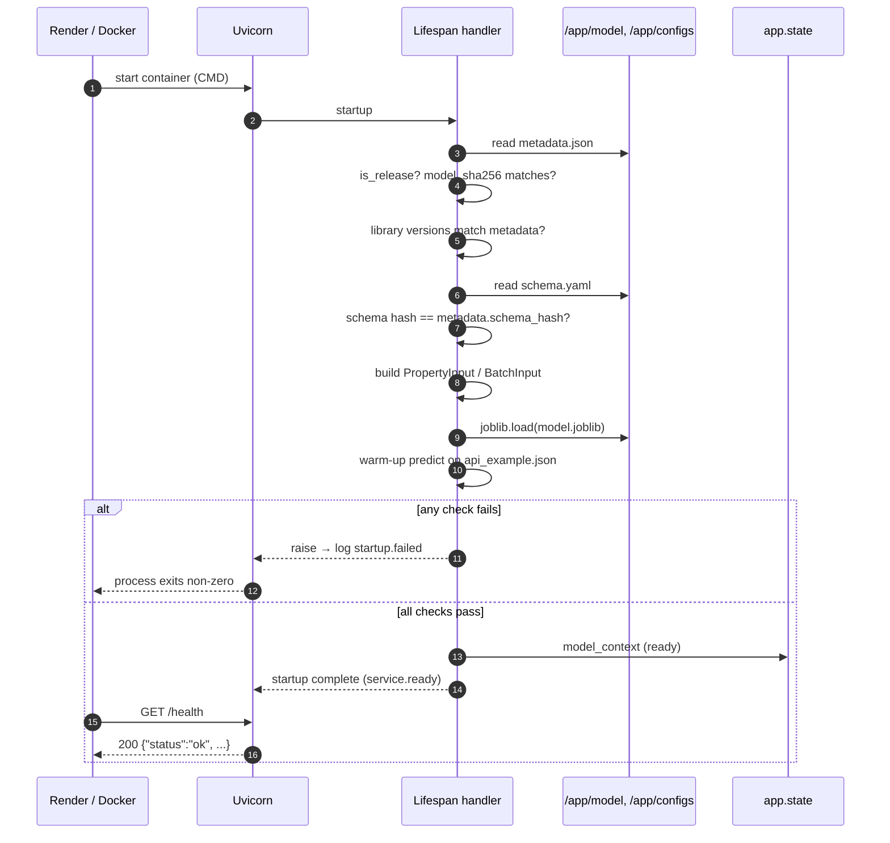
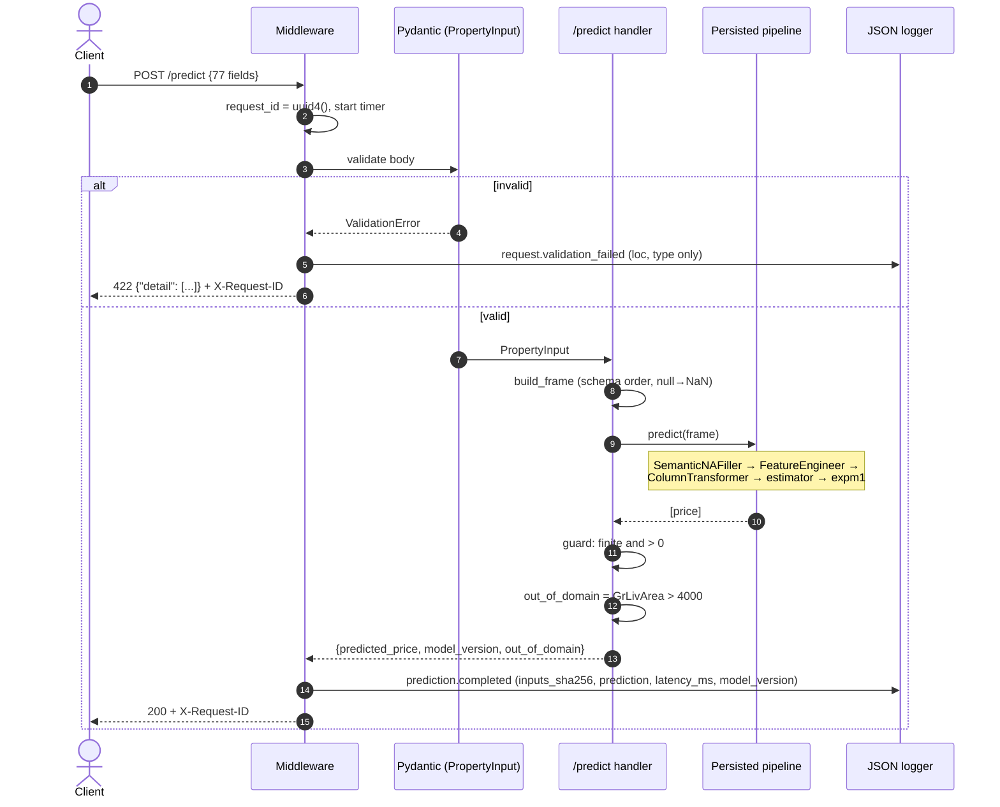

# DOC-04: Serving and Deployment Design

**Project:** House Price Prediction — End-to-End ML Regression System
**Document ID:** DOC-04
**Version:** 1.1
**Status:** Approved baseline — revision 1.1 (dataset alignment: the project uses the full 2,930-row Ames file; see `docs/data_card.md`)
**Date:** 2026-09-28
**Authoritative sources, in precedence order:** `house-price-prediction-adr.md` (ADR-000, ADR-01 to ADR-20) → DOC-01 v1.2 → DOC-02 v1.2 → DOC-03 v1.1
**Related documents:** DOC-03 ML System Design

---

## How to Read This Document

DOC-04 is the implementation blueprint for everything that happens **after** a model artifact is frozen: the FastAPI service, request validation, the prediction path, the batch CLI, the Docker image, Render deployment, logging, operations, and the release process.

It uses the same conventions as DOC-03. Components cite `[ADR-xx]`, `FR-xxx`, `NFR-xxx`, `AC-xxx`, `IN-xx` (DOC-01 interpretation notes), and `DN-xx` (DOC-03 design notes). Details the ADR leaves open are fixed as **serving design notes (SD-xx)**, indexed below. *Serving design notes implement ADR intent; they do not change ADR architecture.* If a note conflicts with a higher-precedence document, that document wins and the note is corrected.

**Serving design note index.**

| SD | Topic | What DOC-04 fixes | Section |
|---|---|---|---|
| SD-01 | Request fields | The request carries the 77-column model input schema (DN-11). Every field must be present; nullable fields must be sent as explicit `null` | 6.4, 7.2 |
| SD-02 | Field names | JSON keys are the canonical column names defined in `schema.yaml` (`name`, for example `1stFlrSF`), not the raw file headers (`1st Flr SF`); they are mapped to valid Python names through aliases | 7.2 |
| SD-03 | Numeric strictness | Numeric fields reject strings and booleans; integer fields accept JSON integers only | 7.3 |
| SD-04 | Batch body and response shapes | `{"properties": [...]}` in, `{"count": n, "predictions": [...]}` out, in input order | 6.5 |
| SD-05 | Error bodies and request IDs | FastAPI's standard 422 body; a generic 500 body; an `X-Request-ID` header on every response | 6.6 |
| SD-06 | Container registry | Release images are pushed to GitHub Container Registry (GHCR), part of the GitHub platform already chosen [ADR-16] | 12.2 |
| SD-07 | Render deployment mode | Render runs the prebuilt image by version tag, with health check `/health` and auto-deploy off | 12 |
| SD-08 | Environment variables | `PORT`, `HPP_MODEL_DIR`, `HPP_CONFIG_DIR`, `HPP_LOG_LEVEL` | 11.6 |
| SD-09 | Worker model | One Uvicorn worker process per container | 11.5 |
| SD-10 | Logging implementation | Standard-library `logging` with a JSON formatter; named events | 13 |
| SD-11 | CI image | CI builds and tests the image with the smoke artifact (DN-17); only frozen artifacts are released | 16.5, 17 |
| SD-12 | Batch CLI columns | Headers are normalized to canonical names as in ingestion (raw dataset layout accepted); `Id` and `PID` pass through; `SaleType`, `SaleCondition`, `SalePrice` are ignored; any other extra column is rejected | 10.2 |
| SD-13 | Startup verification | Model hash, schema hash, library versions, and a warm-up prediction must all pass before the service accepts traffic | 5 |
| SD-14 | LightGBM runtime library | The runtime image installs the OpenMP runtime (`libgomp1`) that LightGBM requires | 11.3 |
| SD-15 | Example payload | `configs/api_example.json` holds one development-set row's 77 inputs; used for OpenAPI docs, warm-up, and tests | 6.4, 5.2 |
| SD-16 | Prediction guard | Any non-finite or non-positive prediction is treated as a server error, never returned | 8.3 |

---

# 1. Purpose and Scope

## 1.1 Purpose

This document defines how the frozen model artifact produced by DOC-03 is served, validated, containerized, deployed, and operated. An implementer following it should be able to build the `house_price.api` package, the batch CLI's runtime behavior, the Dockerfile, the CI image job, the Render service, and the release procedure without further architectural decisions.

## 1.2 In Scope

- FastAPI application, startup lifecycle, and the four endpoints [ADR-15, FR-040 to FR-047]
- Pydantic v2 request and response schemas generated from the shared contract [ADR-04, FR-044, FR-005]
- The prediction lifecycle and training–serving consistency [ADR-08, NFR-024]
- The batch prediction CLI [ADR-15, FR-050]
- Docker image design [ADR-15, FR-048]
- Render deployment [ADR-15, FR-049]
- Logging, security and reliability, operational monitoring [ADR-15, NFR-005, NFR-025, NFR-029]
- Serving-side testing and the release process [ADR-16, ADR-18]

## 1.3 Out of Scope

- Everything up to the frozen artifact (DOC-03)
- Authentication, rate limiting, load testing, autoscaling, drift monitoring, and any frontend [ADR-03, ADR-18]; these are recorded as accepted risks in Section 14.5

---

# 2. Relationship to DOC-03

DOC-03 delivers a **frozen artifact directory**, `models/x.y.z/`, containing `model.joblib` and `metadata.json` (DOC-03 §15). DOC-04 consumes only that directory plus the repository's `configs/`. The contract between the two documents:

| DOC-03 provides | DOC-04 relies on it for |
|---|---|
| The fitted `TransformedTargetRegressor` that accepts the 77-column model input frame and returns dollars | The entire prediction path; serving never reimplements preprocessing (NFR-024) |
| `metadata.input_schema` and `schema_hash` | Startup check that the API contract equals the training contract (FR-005) |
| `metadata.scope_rule` (`GrLivArea`, 4000) | The `out_of_domain` flag (FR-045) |
| `metadata.model_sha256` | Integrity check before `joblib.load` (NFR-025) |
| `metadata.library_versions` | Runtime environment check (NFR-002) |
| `metadata.model_version`, `is_release` | Version in every response; refusal to serve non-release artifacts in production (NFR-011) |
| `configs/schema.yaml` | Generating the Pydantic request model and the CLI's inference schema (FR-005) |
| Smoke artifacts (DN-17) | CI image build and container tests only (SD-11) |

The single rule that ties the two documents together: **serving may only call `pipeline.predict()` on a correctly built input frame.** Everything else in DOC-04 exists to make sure that frame is valid, that the right artifact is loaded, and that the result is reported and logged correctly.

---

# 3. End-to-End Serving Architecture

## 3.1 Logical Flow

| # | Stage | What happens | Component |
|---|---|---|---|
| 1 | Trained artifact | Frozen `models/x.y.z/` baked into the image | Docker image [ADR-15] |
| 2 | FastAPI | Receives HTTP request; assigns request ID | `api.app` |
| 3 | Validation | Pydantic model generated from `schema.yaml` validates every field | `api.schemas` |
| 4 | Frame construction | Validated fields → one-row (or n-row) `DataFrame` in schema column order; `null` → `NaN` | `api.predict` |
| 5 | Prediction pipeline | `pipeline.predict(frame)`: semantic fill → feature engineering → preprocessing → model → `expm1` | Persisted artifact |
| 6 | Response generation | Guard check (SD-16), `out_of_domain` flag, model version | `api.predict` |
| 7 | Logging | One JSON log line per prediction request | `api.logging` |
| 8 | Client | Receives JSON response with `X-Request-ID` header | — |

---

# 4. Serving Architecture Diagram

## 4.1 Component View

```
                          ┌──────────────────────────── Docker image (python:3.12-slim) ─────────────────────────────┐
                          │                                                                                         │
                          │   /app/model/          model.joblib  metadata.json      (frozen models/x.y.z)           │
                          │   /app/configs/        schema.yaml   api_example.json   serving values                 │
                          │   /app/.venv/          locked dependencies (uv)                                         │
                          │                                                                                         │
  Client ──HTTPS──► Render│   Uvicorn (1 worker, 0.0.0.0:$PORT)                                                     │
  (curl, script,   proxy ─┼─► FastAPI app  ── lifespan: load + verify (Section 5) ──► app.state.model_context       │
  CLI user)               │     │                                                                                   │
                          │     ├─ middleware: request ID, timing                                                   │
                          │     ├─ GET  /health       → status + model version                                     │
                          │     ├─ GET  /model-info   → metadata.json                                              │
                          │     ├─ POST /predict      → PropertyInput ─┐                                           │
                          │     └─ POST /predict/batch → BatchInput ───┤                                           │
                          │                                           ▼                                             │
                          │                            frame builder (schema column order, null → NaN)             │
                          │                                           ▼                                             │
                          │                  pipeline.predict(frame)  ◄── the persisted DOC-03 object               │
                          │                                           ▼                                             │
                          │                            guard (finite, > 0) + out_of_domain + version                │
                          │                                           ▼                                             │
                          │                            JSON response  ──►  stdout JSON log line                     │
                          └─────────────────────────────────────────────────────────────────────────────────────────┘
                                                                                     │
                                                                               Render log stream
```

## 4.2 Where Each Concern Lives

| Concern | Lives in | Never in |
|---|---|---|
| Field presence, types, allowed values, ranges | Pydantic model generated from `schema.yaml` | Hand-written endpoint code |
| Missing-value semantics, feature engineering, encoding, scaling, target inverse | The persisted pipeline | API code |
| Domain flag threshold | `metadata.scope_rule` | Hard-coded constant |
| Model version | `metadata.model_version` | Environment variable or code constant |

---

# 5. Startup Lifecycle

## 5.1 Overview

The service uses a FastAPI **lifespan** handler. All loading and verification happens once, before the server accepts any request (FR-046). If any step fails, the process exits with a non-zero code: a service that cannot prove it is serving the right model must not serve at all (SD-13, NFR-004 applied to serving).

## 5.2 Startup Steps

| # | Step | Check | Failure behavior |
|---|---|---|---|
| 1 | Read settings | `PORT`, `HPP_MODEL_DIR`, `HPP_CONFIG_DIR`, `HPP_LOG_LEVEL` parsed into a Pydantic settings model (SD-08) | Exit: invalid configuration |
| 2 | Configure logging | JSON formatter on stdout at the configured level (SD-10) | — |
| 3 | Load metadata | `metadata.json` parsed with the same Pydantic metadata model DOC-03 writes with (DOC-03 §15.3) | Exit: missing or invalid metadata |
| 4 | Release check | `is_release` must be `true`, unless `HPP_ALLOW_NON_RELEASE=true` is set (only in CI, SD-11) | Exit: non-release artifact |
| 5 | Artifact integrity | SHA-256 of `model.joblib` equals `metadata.model_sha256` (DN-15) | Exit: hash mismatch; the file is **not** loaded |
| 6 | Environment check | Installed versions of scikit-learn, LightGBM, NumPy, pandas, SciPy, joblib equal `metadata.library_versions` | Exit: version mismatch (pickled objects are not guaranteed compatible across versions [ADR-14]) |
| 7 | Load schema | Read `schema.yaml`; build the ordered 77-column model input schema; compute its hash | Exit: invalid schema |
| 8 | Contract check | Computed schema hash equals `metadata.schema_hash` | Exit: API contract differs from the training contract (FR-005) |
| 9 | Build request models | Generate `PropertyInput` and `BatchInput` Pydantic models from the schema (Section 7) | Exit |
| 10 | Load model | `joblib.load(model.joblib)` | Exit |
| 11 | Warm-up | Validate `configs/api_example.json` through `PropertyInput`, predict once, and apply the SD-16 guard | Exit: example invalid or prediction not finite and positive |
| 12 | Publish state | Store model, metadata, schema, and models in `app.state.model_context`; set `ready=True` | — |
| 13 | Log readiness | `service.ready` event with model version, load time, and the schema hash | — |

**Why verify so much at startup.** Every check here protects against a failure mode that would otherwise be silent. A mismatched schema would accept requests the model was not trained for. A mismatched library version could load a subtly broken model. A tampered or truncated file would be unpickled before anyone noticed. Failing fast at startup turns each of these into a visible deployment failure instead of wrong predictions in production.

## 5.3 Startup Sequence



## 5.4 Health Verification

`/health` returns 200 only after step 12. Because every failure in steps 1–11 terminates the process, a responding service is by construction a verified service. Render uses `/health` to decide whether a new deploy is live (Section 12).

## 5.5 Shutdown

On SIGTERM, Uvicorn stops accepting connections and finishes in-flight requests; the lifespan handler logs `service.stopping`. The model holds no external resources, so nothing else needs releasing.

---

# 6. API Design

## 6.1 Common Conventions

| Convention | Rule |
|---|---|
| Media type | `application/json` for requests and responses |
| Field names | Canonical column names from `schema.yaml` (SD-02) |
| Money | `predicted_price` is a JSON number in US dollars, not rounded |
| Request ID | Every response carries `X-Request-ID` (a new UUID4 per request) (SD-05) |
| Extra fields | Rejected with 422 (`extra="forbid"`) |
| Versioning | Model version in the response body; there is no URL version prefix, since the API contract changes only with a MAJOR model version (DOC-03 §15.4) |

## 6.2 `GET /health`

- **Purpose:** liveness and readiness for Render and for humans (FR-040).
- **Request:** no body, no parameters.
- **Response 200:**

| Field | Type | Meaning |
|---|---|---|
| `status` | string, always `"ok"` | Service is running and verified |
| `model_version` | string | Loaded model version |

- **Validation behavior:** none.
- **Error behavior:** the endpoint cannot return a non-200 status in normal operation, because an unverified service never starts (Section 5.4). Health checks are not logged, to keep Render's polling out of the logs.
- **Verifies:** AC-048.

## 6.3 `GET /model-info`

- **Purpose:** expose the loaded model's full metadata for diagnostics and audit (FR-041, NFR-029).
- **Request:** no body.
- **Response 200:** the exact contents of the loaded `metadata.json` (DOC-03 §15.3), including version, provenance, metrics, quality gates, `input_schema`, and `scope_rule`.
- **Why the full metadata:** AC-049 requires the body to equal `metadata.json`. The file contains no secrets (the dataset is public; hashes and versions are not sensitive), and exposing it lets any client see exactly which contract, metrics, and code produced the model.
- **Error behavior:** none in normal operation.
- **Verifies:** AC-049.

## 6.4 `POST /predict`

- **Purpose:** price one property (FR-042).
- **Request body:** one `PropertyInput` object with exactly the 77 model-input fields (SD-01).

| Aspect | Rule |
|---|---|
| Fields | The 77 model-input columns (the 79 features minus `SaleType`, `SaleCondition`); the identifiers `Id` and `PID` and the target `SalePrice` are not accepted |
| Presence | Every field must be present |
| Nullable fields | The 27 columns marked `nullable: true` in `schema.yaml`, i.e. those containing missing values in the dataset: the absent-feature categoricals (`PoolQC`, `MiscFeature`, `Alley`, `Fence`, `FireplaceQu`, the four `Garage*` and five `Bsmt*` categoricals, `MasVnrType`), their related numerics (`MasVnrArea`, `GarageCars`, `GarageArea`, `BsmtFinSF1`, `BsmtFinSF2`, `BsmtUnfSF`, `TotalBsmtSF`, `BsmtFullBath`, `BsmtHalfBath`), plus `LotFrontage`, `GarageYrBlt`, and `Electrical`, accept `null`; all others reject it (FR-044) |
| Types, allowed values, ranges | From `schema.yaml` (Section 7) |

**Why every field must be present, even the nullable ones (SD-01).** In this dataset, `null` carries meaning: `PoolQC: null` means "no pool" (DOC-02 §6.2). If fields could be omitted, a client that forgot `PoolQC` would silently be told "no pool". Requiring an explicit `null` makes the client state absence deliberately, and catches typos and forgotten fields as 422 errors.

**Why `SaleType` and `SaleCondition` are not in the request.** ADR-02 excludes them because they are not known before a sale closes. Requiring clients to send them, even to be discarded, would ask for information that does not exist at pricing time (DOC-02 §11.7). The ADR's "full raw schema contract" [ADR-15] is therefore implemented as the full raw schema of **model-input** columns (DN-11).

- **Example:** `configs/api_example.json` (SD-15) holds one development-set row's 77 inputs, chosen once after the split is created. It is attached to the OpenAPI schema as the request example (FR-055, AC-058) and used for startup warm-up.

- **Response 200:**

| Field | Type | Meaning |
|---|---|---|
| `predicted_price` | number (> 0) | Estimated price in dollars (the median-type estimate from the log model, DOC-02 §5.5) |
| `model_version` | string | Version of the model that produced it |
| `out_of_domain` | boolean | `true` if `GrLivArea > metadata.scope_rule.max_in_domain` (FR-045) |

- **Validation behavior:** Section 7. Out-of-domain inputs are valid; they receive a prediction with the flag set (AC-054).
- **Error behavior:** 422 on any validation failure, and no prediction is made (AC-052); 500 on an internal failure, including an SD-16 guard violation (Section 6.6).
- **Verifies:** AC-050, AC-052 to AC-054, AC-057.

## 6.5 `POST /predict/batch`

- **Purpose:** price 1 to 100 properties in one call (FR-043).
- **Request body (SD-04):**

| Field | Type | Rule |
|---|---|---|
| `properties` | array of `PropertyInput` | Length 1 to 100 inclusive (upper bound [ADR-15]; lower bound IN-05); `extra="forbid"` at the top level too |

- **Response 200:**

| Field | Type | Meaning |
|---|---|---|
| `count` | integer | Number of predictions, equal to the input length |
| `predictions` | array | One object per input, **in input order** |
| `predictions[i].index` | integer | Position of the property in the request (0-based) |
| `predictions[i].predicted_price` | number | As in `/predict` |
| `predictions[i].model_version` | string | As in `/predict` (FR-043 requires the same fields per item) |
| `predictions[i].out_of_domain` | boolean | As in `/predict` |

- **Validation behavior:** validation is **atomic**: if any property is invalid, the whole request receives 422 and nothing is predicted. The error `loc` identifies the failing item (for example `["body", "properties", 7, "PoolQC"]`). Atomic validation keeps the response simple (every item has a prediction) and prevents clients from silently ignoring rejected rows.
- **Error behavior:** 0 items or more than 100 → 422 (AC-051). All properties are predicted in one `pipeline.predict` call on an n-row frame; if the SD-16 guard fails for any row, the request returns 500.
- **Verifies:** AC-051.

## 6.6 Error Model (SD-05)

| Status | When | Body |
|---|---|---|
| 422 | Any request validation failure: missing field, extra field, wrong type, disallowed category, out-of-range number, `null` in a non-nullable field, batch size outside 1–100, malformed JSON | FastAPI's standard body: `{"detail": [{"type", "loc", "msg", "input", ...}, ...]}` |
| 404 / 405 | Unknown path or wrong method | FastAPI defaults |
| 500 | Unexpected exception or SD-16 guard violation | `{"detail": "Internal server error", "request_id": "<uuid>"}`; no stack trace, no input echo |

The standard 422 body is kept because it is what FastAPI clients and the OpenAPI documentation already describe, and it precisely locates each error.

---

# 7. Pydantic Validation Design

## 7.1 Generation from the Shared Contract

`house_price.api.schemas.build_request_models(schema)` builds the request models at startup with Pydantic's `create_model`, from the same `schema.yaml` that DOC-03 uses to build the Pandera schemas [ADR-04, FR-005]. There is no hand-written list of fields anywhere in the API code, so the API contract cannot drift from the training contract. The startup contract check (Section 5.2, step 8) verifies this at every start.

## 7.2 Schema Enforcement

| Aspect | Implementation |
|---|---|
| Field names (SD-02) | Internal names are sanitized Python identifiers (for example `f_1stFlrSF`); each has an alias equal to the canonical column name in `schema.yaml`. Requests and responses use the alias. Raw file headers (`source_name`, for example `1st Flr SF`) are not accepted by the API |
| Presence (SD-01) | Every field is declared required; nullable fields are typed `T | None` but still required |
| Extra fields | `model_config = ConfigDict(extra="forbid")` |
| Order | Irrelevant in JSON; the frame builder orders columns by the schema (DOC-03 §7.7) |

## 7.3 Numerical Constraints

| Column dtype in `schema.yaml` | Pydantic type | Constraint source |
|---|---|---|
| `int` | `StrictInt` with `ge`/`le` from the column's range | `schema.yaml` range |
| `float` | `StrictFloat` (JSON integers also accepted) with `ge`/`le` (or `gt` where the range is exclusive, as for `GrLivArea > 0`) | `schema.yaml` range |

**Why strict (SD-03).** In lax mode, Pydantic would accept `"2"` as the integer 2 and may convert booleans. For a data contract, a string or boolean in a numeric field is almost always a client bug, and it should be reported rather than guessed (AC-052: "non-numeric value in a numeric field" → 422).

Ranges are the same class-based ranges defined in DOC-03 §5.3. In particular, `GrLivArea` accepts values above 4,000 (up to the plausibility ceiling) so that above-scope homes can be scored and flagged, and `YrSold` is limited to the dataset's 2006–2010 valuation window.

## 7.4 Categorical Constraints

| Column | Pydantic type |
|---|---|
| Text categoricals | `Literal[...]` of the allowed values from `schema.yaml` (data-dictionary codes plus the file's verified spellings, DOC-03 §5.3) |
| `MSSubClass` | `Literal[20, 30, 40, ...]` of the allowed integer codes (it is a code; the pipeline casts it to a string internally, DN-12) |

Values are case-sensitive and must match exactly. No normalization such as trimming or lower-casing is applied, because it would make the API accept inputs that ingestion validation would reject (FR-005).

## 7.5 API Error Handling

- **Validation errors (422):** raised by FastAPI before the endpoint body runs, so no prediction code executes for an invalid request (NFR-005). A handler logs a `request.validation_failed` event with the request ID, endpoint, and the list of `(loc, type)` pairs. Input **values** are not logged.
- **Unexpected errors (500):** a catch-all exception handler logs `request.failed` with the exception type and traceback, and returns the generic body. The service keeps running.
- **Guard violations (500):** see Section 8.3.

---

# 8. Prediction Lifecycle

## 8.1 Steps

| # | Step | Where | Notes |
|---|---|---|---|
| 1 | Request arrives | Uvicorn → FastAPI | Middleware assigns the request ID and starts a timer |
| 2 | Validation | Pydantic `PropertyInput` / `BatchInput` | 422 on failure; nothing else runs |
| 3 | Frame construction | `api.predict.build_frame` | `model_dump(by_alias=True)`; columns ordered by schema; `None` → `NaN`; dtypes set per schema |
| 4 | Semantic missing-value fill | Pipeline: `SemanticNAFiller` | Same object as training (DOC-03 §6.2) |
| 5 | Feature engineering | Pipeline: `FeatureEngineer` | Ages use the request's `YrSold` as the valuation year |
| 6 | Preprocessing | Pipeline: `ColumnTransformer` | Imputation with training-fitted statistics; encoding with training-fitted categories |
| 7 | Model prediction | Pipeline: estimator | Log-price prediction |
| 8 | Reverse target transformation | `TransformedTargetRegressor` applies `expm1` | Dollars |
| 9 | Guard | `api.predict` | Finite and > 0, else 500 (SD-16) |
| 10 | Response | `api.predict` | Adds `out_of_domain` and `model_version` |
| 11 | Log | `api.logging` | One `prediction.completed` line |

Steps 4 to 8 are a single call, `model.predict(frame)`. They are listed separately to show that each training step also runs at serving time, inside the same object.

## 8.2 Sequence: Single Prediction



## 8.3 Prediction Guard (SD-16)

After `predict`, every value must be finite and greater than zero (NFR-007). A violation means the model or its inputs are in a state the design says cannot happen. The service does not return a bad number: it logs `prediction.guard_violation` at ERROR level with the request ID and inputs hash, and responds 500. This follows the project principle that a silent wrong answer is worse than a visible failure.

## 8.4 Sequence: Batch Prediction

```mermaid
sequenceDiagram
    autonumber
    actor C as Client
    participant V as Pydantic (BatchInput)
    participant E as /predict/batch handler
    participant P as Persisted pipeline
    participant Lg as JSON logger

    C->>V: POST /predict/batch {"properties": [p0 … pn-1]}
    alt n < 1 or n > 100 or any item invalid
        V-->>C: 422 (loc points at the failing item)
    else all valid
        V->>E: BatchInput
        E->>E: build_frame (n rows, schema order)
        E->>P: predict(frame)  (one vectorized call)
        P-->>E: n prices
        E->>E: guard all rows; flags per row
        E->>Lg: prediction.completed (n_items, inputs_sha256, predictions, latency_ms)
        E-->>C: 200 {count: n, predictions: [{index, predicted_price, model_version, out_of_domain}, …]}
    end
```

---

# 9. Training–Serving Consistency Design

## 9.1 Guarantees and Mechanisms

| Guarantee | Mechanism | Verified by |
|---|---|---|
| **Identical preprocessing** | Preprocessing exists only inside the persisted pipeline; the API calls `predict` and nothing else (NFR-024) | AC-057; code review rule: `api/` imports nothing from `house_price.features` or `house_price.pipelines` |
| **Identical feature engineering** | `FeatureEngineer` is a step of the persisted object; its formulas are not duplicated anywhere | AC-057 |
| **Identical schema** | Pydantic models and Pandera schemas are generated from one `schema.yaml`; its hash must equal `metadata.schema_hash` at startup | AC-005, startup step 8, `test_contract_parity` |
| **Identical model behavior** | Integrity hash, exact library versions, same lockfile in training and image | AC-046, AC-060, startup steps 5–6 |
| **Identical domain rule** | `out_of_domain` threshold read from `metadata.scope_rule`, written by the training scope step | AC-054 |
| **Identical missing-value semantics** | `null` → `NaN` in the frame builder, exactly as a parsed `NA` in training (DN-18) | AC-053, AC-057 |

## 9.2 The Consistency Test (AC-057)

`tests/integration/test_training_serving_consistency.py`:

1. Load a fixture of development-set rows (including rows with every absent-feature pattern, a missing `LotFrontage`, and at least one unseen-category case allowed by the schema).
2. For each row, send the 77 fields to `POST /predict` through the test client, with `NaN` converted to `null`.
3. Call `model.predict` directly on the same row as a one-row frame.
4. Assert exact equality of the two prices.

Exact equality is expected, and required, because both paths execute the same object on the same values in the same process; any difference would indicate a conversion bug in the frame builder.

## 9.3 Contract Parity Test

`tests/unit/test_contract_parity.py` generates a set of valid rows and a set of single-fault rows (one per rule: missing column, wrong type, disallowed value, out of range, null in a non-nullable field). It asserts that the Pydantic model and the Pandera inference schema accept exactly the same valid rows and reject exactly the same faulty rows. This protects FR-005 and makes the CLI and API reject the same inputs (AC-063).

---

# 10. Batch Prediction Design

## 10.1 CLI Workflow

```
make predict INPUT=path/to/properties.csv OUTPUT=path/to/predictions.csv
# → house-price predict --input … --output … [--model-dir models/x.y.z]
```

| # | Step | Detail |
|---|---|---|
| 1 | Load artifact | Same verification as service startup steps 3–10 (release check, hash, versions, schema hash) using `--model-dir` (default: the directory named by `HPP_MODEL_DIR`) |
| 2 | Parse CSV | Same parsing as ingestion: default missing-token lists disabled; only `NA` and the empty string are missing (DN-18); every column read as text, then cast per `schema.yaml` |
| 3 | Normalize headers and check columns | Rename headers with the same `schema.yaml` mapping the ingestion layer uses (`source_name` → `name`, DOC-03 §5.2), then apply SD-12 (Section 10.2) |
| 4 | Validate | Pandera **inference schema** (the model-input subset of `schema.yaml`), lazy mode, collecting all failures |
| 5 | On any failure | Write no output file; print a failure report (row number, column, check, offending value); exit code 2 (AC-062) |
| 6 | Predict | One `model.predict` call on the 77-column frame in schema order |
| 7 | Guard | SD-16 on every row; a violation exits with code 3 and writes no output |
| 8 | Write output | CSV described in Section 10.3; exit code 0 |
| 9 | Log | One `batch.completed` JSON line: input file hash, row count, model version, duration |

**Why reject the whole file on one bad row (IN-14).** Partial output invites silent data loss: a downstream user might not notice that rows are missing. Rejecting the whole file, with a complete report of every problem, makes the outcome unambiguous. This matches the API's atomic batch validation.

## 10.2 Input Format (SD-12)

| Column | Rule |
|---|---|
| The 77 model-input columns | Required, any order (reordered to schema order internally) |
| `Id`, `PID` | Optional identifiers; if present, copied to the output unchanged and never used for prediction |
| `SaleType`, `SaleCondition`, `SalePrice` | Optional; ignored, with a `batch.columns_ignored` log line |
| Any other column | Rejected (exit code 2), so that typos in column names are caught |

**Header normalization.** Before the rules above are applied, headers are renamed with the `schema.yaml` mapping used by ingestion (`source_name` → `name`; for example `Gr Liv Area` → `GrLivArea`, `Order` → `Id`). A file may therefore use either the raw dataset headers or the canonical names, so files in the raw dataset layout (including `data/raw/train.csv` itself) can be scored without manual renaming. Only names change; values are not modified. After normalization, a column that is still unknown, or a column that appears twice (for example both `GrLivArea` and `Gr Liv Area`), is rejected (exit code 2).

Encoding: UTF-8, comma-separated, header row required.

## 10.3 Output Format

| Column | Content |
|---|---|
| `row_index` | 0-based position in the input file |
| `Id` | Present only if the input had `Id` (or the raw header `Order`) |
| `PID` | Present only if the input had `PID` |
| `predicted_price` | Dollars, full floating-point precision (written with round-trip-safe formatting so that values equal API responses exactly, AC-063) |
| `out_of_domain` | `true` / `false` |
| `model_version` | From metadata |

Rows are in input order.

## 10.4 Operational Limits

| Limit | Value | Why |
|---|---|---|
| Rows per file | No enforced limit; designed for files up to tens of thousands of rows in memory | The ADR's 100-item cap applies to the API [ADR-15]; the CLI is an offline tool on the user's own machine |
| Memory | The whole file is loaded at once | Simplicity; the dataset scale does not justify chunking |
| Model | Exactly one model version per run, recorded in every output row | Traceability (NFR-029) |

---

# 11. Docker Design

## 11.1 Image Structure

Final image filesystem:

```
/app
├── .venv/                     # locked runtime dependencies (no dev tools)
├── src/house_price/           # installed package
├── configs/
│   ├── schema.yaml
│   ├── api_example.json
│   └── (other YAML files, read-only)
└── model/
    ├── model.joblib           # frozen models/x.y.z/model.joblib
    └── metadata.json
```

## 11.2 Build Stages and Layers

A two-stage build keeps build tools out of the runtime image:

| Stage | Base | Steps | Layer-caching rationale |
|---|---|---|---|
| `builder` | `python:3.12-slim` | Copy the `uv` binary; copy `pyproject.toml` and `uv.lock` **only**; `uv sync --frozen --no-dev` into `/app/.venv`; then copy `src/` and install the project package | Dependencies change far less often than code, so copying the lockfile first lets Docker reuse the dependency layer across code changes |
| `runtime` | `python:3.12-slim` | Install `libgomp1` (SD-14); create the non-root user; copy `/app/.venv` and `src/` from the builder; copy `configs/`; copy the model directory last | The model layer changes with every release; placing it last means code and dependency layers are reused |

Build arguments:

| Argument | Meaning |
|---|---|
| `MODEL_DIR` | Path in the build context of the artifact directory to bake in (for example `models/1.0.0`, or the smoke artifact directory in CI) |
| `MODEL_VERSION` | Recorded as the OCI label `org.opencontainers.image.version`; must equal `metadata.model_version` (checked by the build script) |

`.dockerignore` excludes `data/`, `mlruns/`, `notebooks/`, `reports/`, `tests/`, `.git/`, and every `models/` subdirectory except the one being baked in.

## 11.3 Artifact Packaging

- The artifact is **baked into the image** [ADR-15]. There is no volume mount and no download at runtime.
- An image tag therefore identifies exactly one model: image `…:1.0.0` contains `models/1.0.0` (NFR-012).
- **SD-14:** LightGBM's compiled library links against the OpenMP runtime, which `python:3.12-slim` does not include. The runtime stage installs `libgomp1` with `apt-get install --no-install-recommends` and clears the package lists. This is a system library required by an existing dependency, not a new tool. It is installed even when the selected model is not LightGBM, because the package is imported through the pipeline's dependencies and the image must not depend on which candidate was selected.

## 11.4 Non-Root Execution

- The runtime stage creates a system user `appuser` (UID 10001, no login shell, no home-directory writes needed).
- `/app` is owned by root and readable by `appuser`; the application never writes to disk.
- `USER appuser` is set before `CMD`, so the server process runs without root privileges (FR-048, NFR-025, AC-059).

## 11.5 Runtime Design (SD-09)

- **Command:** `uvicorn house_price.api.app:app --host 0.0.0.0 --port ${PORT:-8000} --workers 1 --no-access-log`, run through `sh -c` so that `PORT` is expanded.
- **One worker.** Each worker would load its own copy of the model. A single worker keeps memory predictable on a small Render instance, and prediction is fast on this model size. Uvicorn's own access log is disabled because the service writes its own structured request log (Section 13); keeping both would duplicate lines in a second, unstructured format.
- **Endpoint functions are synchronous (`def`).** FastAPI runs them in its thread pool, so a CPU-bound `predict` does not block the event loop.
- **Container health check:** a `HEALTHCHECK` instruction runs a short Python standard-library HTTP call against `http://127.0.0.1:${PORT:-8000}/health` (the slim image has no `curl`). Used by `docker run` locally; Render uses its own health check (Section 12).

## 11.6 Environment Variables (SD-08)

| Variable | Default | Purpose |
|---|---|---|
| `PORT` | `8000` | Listening port; Render sets it for the service |
| `HPP_MODEL_DIR` | `/app/model` | Artifact directory |
| `HPP_CONFIG_DIR` | `/app/configs` | Configuration directory |
| `HPP_LOG_LEVEL` | `INFO` | Log level |
| `HPP_ALLOW_NON_RELEASE` | `false` | Allows a smoke artifact to load; set only by the CI container test (SD-11) |

Nothing in the image is secret, so no secret variables exist. The model version is deliberately **not** an environment variable: it comes only from `metadata.json`, so it cannot disagree with the artifact.

## 11.7 Exposed Ports

`EXPOSE 8000` documents the default. On Render, the service listens on the `PORT` value Render provides; Render's proxy terminates HTTPS and forwards to it.

---

# 12. Render Deployment Design

## 12.1 Deployment Architecture

```
Developer machine                    GitHub                               Render
─────────────────                    ──────                               ──────
make train / evaluate / freeze
        │
        ▼
docker build (MODEL_DIR=models/x.y.z)
        │  container smoke test
        ▼
docker push ─────────────────► ghcr.io/<owner>/house-price-api:x.y.z
git tag vx.y.z; git push --tags ─► repository (tag)
                                                       │
                                           Render Web Service (Docker image runtime)
                                           image: ghcr.io/<owner>/house-price-api:x.y.z
                                           health check path: /health
                                           instance: free tier
                                           env: HPP_LOG_LEVEL=INFO (PORT set by Render)
                                                       │
Client ──HTTPS──► https://<service>.onrender.com ──► container :$PORT
```

## 12.2 Why Deploy a Prebuilt Image (SD-06, SD-07)

ADR-15 requires the artifact to be baked into the image, and ADR-17 keeps `models/` out of git. Render's build-from-repository mode would therefore build an image **without** the model. The only way to satisfy both decisions is to build the image where the frozen artifact exists and give Render the finished image:

- The image is built once, tested, and deployed unchanged. What was tested is exactly what runs (NFR-026).
- The registry is **GitHub Container Registry**, part of the GitHub platform the ADR already selected [ADR-16]; no new service provider is added.
- The GHCR package is **public**. The image contains only public data derivatives, code, and a model; making it public avoids storing registry credentials in Render.

## 12.3 Deployment Flow

| # | Step | Actor | Check |
|---|---|---|---|
| 1 | Frozen artifact exists at `models/x.y.z/` | Developer (DOC-03 `freeze`) | Quality gates QG-10 to QG-16 passed |
| 2 | Build image with `MODEL_DIR=models/x.y.z`, `MODEL_VERSION=x.y.z` | `make docker-build` | Label equals metadata version |
| 3 | Local container test | `make docker-test` | Non-root, `/health` 200, example prediction equals direct pipeline prediction (AC-059, AC-060) |
| 4 | Push `ghcr.io/<owner>/house-price-api:x.y.z` | `make docker-push` | Tag does not already exist in the registry (tags are immutable by convention) |
| 5 | Update the Render service's image tag to `x.y.z` and deploy | Developer (Render dashboard or the service's deploy hook) | — |
| 6 | Render pulls the image, starts the container, polls `/health` | Render | New deploy goes live only after `/health` responds 200 |
| 7 | Post-deploy verification | Developer | `/health` 200 over HTTPS; `/model-info` version = `x.y.z` (AC-061), recorded in the release notes |

## 12.4 Build Process

The build happens on the developer's machine for releases (step 2) and in GitHub Actions for CI (Section 16.5). Render performs no build: it only pulls images.

## 12.5 Runtime Process

- Render starts the container with its `PORT` value.
- The lifespan handler performs all startup checks (Section 5).
- If startup fails, the container exits and the health check never passes. Render marks the deploy as failed and does not route traffic to it; the previous successful deploy keeps serving, so a bad image cannot replace a good one. This behavior is confirmed on the chosen instance type during the first deployment and recorded in the release notes.
- The free tier stops idle services; the first request after idling incurs a cold start, including the full startup verification. This is an accepted tradeoff [ADR-15].

## 12.6 Configuration Management

| Setting | Where it lives | Value |
|---|---|---|
| Image and tag | Render service settings | `ghcr.io/<owner>/house-price-api:x.y.z` |
| Health check path | Render service settings | `/health` |
| Auto-deploy | Render service settings | Off: a deploy happens only when the tag is deliberately changed |
| `HPP_LOG_LEVEL` | Render environment | `INFO` |
| `PORT` | Set by Render | Render's value |
| Everything else | Baked into the image | — |

**Rollback.** Change the image tag back to the previous version and deploy. Because each version is a complete immutable image, rollback involves no rebuild.

---

# 13. Logging Strategy

## 13.1 Format (SD-10)

- Standard-library `logging` with a small JSON formatter in `house_price.api.logging` (no additional logging library).
- One JSON object per line on stdout; Render collects stdout.
- Common fields on every line: `timestamp` (UTC ISO-8601), `level`, `event`, `service` (`house-price-api`), `model_version` (once loaded).

## 13.2 Startup Logs

| Event | Level | Fields |
|---|---|---|
| `service.starting` | INFO | Settings (without paths' contents) |
| `artifact.verified` | INFO | `model_sha256`, `is_release` |
| `environment.verified` | INFO | Library versions |
| `schema.verified` | INFO | `schema_hash` |
| `model.loaded` | INFO | Load time in ms |
| `warmup.completed` | INFO | Warm-up prediction latency |
| `service.ready` | INFO | `model_version`, total startup time |
| `startup.failed` | CRITICAL | Failing step, reason (for example expected vs actual hash) |
| `service.stopping` | INFO | — |

## 13.3 Request and Prediction Logs

One line per prediction request, `prediction.completed` (FR-047, AC-056):

| Field | Content |
|---|---|
| `request_id` | UUID, same as the `X-Request-ID` header |
| `endpoint` | `/predict` or `/predict/batch` |
| `n_items` | 1 or the batch size |
| `inputs_sha256` | SHA-256 of the canonical JSON of the validated input (sorted keys, aliases, `null` preserved) |
| `prediction` | A number for `/predict`; a list of numbers for `/predict/batch` |
| `out_of_domain_count` | Number of flagged items |
| `latency_ms` | Time from request receipt to response |
| `model_version` | From metadata |
| `status_code` | 200 |

**Why a hash instead of inputs.** ADR-15 specifies an inputs hash. The hash lets two identical requests be matched (for example to investigate a report) without storing full property records in logs. This is the groundwork for future monitoring [ADR-16] without a data-retention burden.

`/health` and `/model-info` are not logged.

## 13.4 Error Logs

| Event | Level | Fields |
|---|---|---|
| `request.validation_failed` | WARNING | `request_id`, `endpoint`, list of `(loc, type)`; **no input values** |
| `prediction.guard_violation` | ERROR | `request_id`, `inputs_sha256`, offending row indices |
| `request.failed` | ERROR | `request_id`, exception type, traceback |
| `batch.failed` (CLI) | ERROR | Input file hash, number of invalid rows, exit code |

---

# 14. Security and Reliability Design

## 14.1 Input Validation

- Every request passes the generated Pydantic model before any code runs (Section 7).
- Extra fields are rejected; types are strict; categories are closed sets; numbers are range-bounded.
- The model never receives values the training contract did not anticipate, except allowed-but-unseen categories, which the pipeline handles by design (NFR-006).

## 14.2 Error Containment

| Failure | Containment |
|---|---|
| Invalid request | 422; nothing predicted; service unaffected |
| One invalid item in a batch | Whole batch 422; no partial predictions |
| Exception in prediction | 500 with a generic body; traceback only in logs; the process continues |
| Guard violation | 500; logged at ERROR; no bad number returned |
| Broken artifact or environment | Caught at startup; the process never serves (Section 5) |

## 14.3 Batch Limits

- API: 1 to 100 properties per request [ADR-15, IN-05], enforced by Pydantic list-length constraints before prediction.
- The batch is predicted in one vectorized call, so its cost grows linearly and stays small at 100 rows.

## 14.4 Startup Verification

The artifact is verified by hash **before** unpickling, because loading a joblib file can execute code (DOC-03 §15.2). Only artifacts produced by this project's training system, with a matching `model_sha256`, are ever loaded (NFR-025). Library versions and the schema hash are also verified (Section 5.2).

## 14.5 Accepted Risks

These are deliberate consequences of ADR scope decisions, recorded so that reviewers see them:

| Risk | Why accepted |
|---|---|
| No authentication | Public demo service over public data; authentication is outside ADR-15's scope |
| No rate limiting | No traffic worth protecting against at this scale [ADR-18]; the 100-item batch cap limits per-request cost |
| No explicit request-body size limit | Bounded in practice by the batch cap and the field set; adding a limit is not an ADR decision |
| Cold starts on the free tier | Accepted by ADR-15 |
| Model is valid only for Ames, 2006–2010, homes ≤ 4,000 sq ft | Enforced where possible: `YrSold` range and the `out_of_domain` flag; documented in the model card |

---

# 15. Operational Monitoring

## 15.1 Health Checks

| Check | Where | Frequency |
|---|---|---|
| Render health check on `/health` | Render | Continuously; gates every deploy |
| Docker `HEALTHCHECK` | Local and CI containers | Every 30 seconds after a 10-second start period |
| Post-deploy manual check | Developer | Every release (AC-061) |

## 15.2 Diagnostics

| Question | How to answer it |
|---|---|
| Which model is live? | `GET /model-info` → `model_version`, `git_commit`, `created_at` |
| Why did a request fail? | Find `request_id` from the response header in Render logs (`request.validation_failed` or `request.failed`) |
| Did the same input get the same answer twice? | Compare `inputs_sha256` and `prediction` across `prediction.completed` lines |
| How often are requests out of domain? | Sum `out_of_domain_count` over log lines |
| How slow is the service? | Distribution of `latency_ms` across log lines (NFR-017: measured, no SLO) |
| Why did a deploy fail? | Render deploy logs → `startup.failed` event with the failing step |

## 15.3 Model Metadata Exposure

`/model-info` exposes the complete lineage (DOC-03 §14.7): version, commit, data hash, library versions, holdout and CV metrics, baseline reference scores, temporal diagnostic, quality gates, input schema, and scope rule. A reviewer can audit the live model entirely through this endpoint and the git repository (NFR-027, NFR-029).

## 15.4 Out of Scope

Drift monitoring, alerting, dashboards, and automated retraining are outside ADR scope [ADR-03, ADR-16]. The structured logs are the designed groundwork for adding them later.

---

# 16. Testing Strategy

All tests run under pytest in CI [ADR-18]. Serving tests use FastAPI's `TestClient` and a **test artifact**: the CI smoke artifact (DN-17) or a small fixture artifact built by a pytest fixture with the same code path, loaded with `HPP_ALLOW_NON_RELEASE=true`.

## 16.1 API Tests (`tests/integration/test_api.py`)

| Test | Checks | AC |
|---|---|---|
| `test_health` | 200, `status` ok, version matches metadata | AC-048 |
| `test_model_info_equals_metadata` | Body equals `metadata.json` | AC-049 |
| `test_predict_example` | 200; positive price; version; `out_of_domain=false` | AC-050 |
| `test_batch_100_ok`, `test_batch_101_rejected`, `test_batch_empty_rejected` | Order preserved; 422 on 101 and 0 | AC-051 |
| `test_predict_rejects_*` (5 cases) | Missing field; disallowed category; out of range; non-numeric in numeric; `null` in non-nullable | AC-052 |
| `test_predict_accepts_nullable_null` | `PoolQC: null` → 200 | AC-053 |
| `test_out_of_domain_boundary` | 4000 → false; 4001 → true | AC-054 |
| `test_model_loaded_once` | 10 requests, 1 load | AC-055 |
| `test_prediction_log_line` | Exactly one parseable JSON line with the required fields | AC-056 |
| `test_openapi_example_valid` | Four endpoints listed; example validates | AC-058 |
| `test_extra_field_rejected`, `test_string_in_int_rejected` | SD-01, SD-03 behavior | AC-052 |
| `test_request_id_header` | Header present and equal to the logged ID | NFR-029 |

## 16.2 Schema Tests

| Test | Checks | AC |
|---|---|---|
| `test_contract_parity` | Pydantic and Pandera inference schema accept and reject identical rows (Section 9.3) | AC-005, AC-063 |
| `test_schema_hash_mismatch_fails_startup` | A modified `schema.yaml` stops startup | FR-005 |
| `test_request_fields_equal_model_input_schema` | The request model has exactly the 77 columns in `metadata.input_schema` | FR-044 |

## 16.3 Consistency Tests

| Test | Checks | AC |
|---|---|---|
| `test_training_serving_consistency` | API price equals direct `predict` for every fixture row (Section 9.2) | AC-057 |
| `test_cli_equals_api` | CLI output equals API output for the same rows | AC-063 |
| `test_cli_rejects_invalid_file` | Exit code 2, no output file, every invalid row reported | AC-062 |
| `test_cli_column_rules` | Raw dataset headers normalized to canonical names; `Id` and `PID` pass through; ignored columns logged; unknown or duplicated column rejected | AC-062 |

## 16.4 Serving and Startup Tests

| Test | Checks |
|---|---|
| `test_startup_rejects_hash_mismatch` | Corrupted artifact → startup fails before `joblib.load` |
| `test_startup_rejects_version_mismatch` | Metadata library version altered → startup fails |
| `test_startup_rejects_non_release` | `is_release=false` without the override → startup fails |
| `test_guard_violation_returns_500` | A stub model returning NaN → 500 and an ERROR log line |
| `test_unexpected_exception_contained` | A stub model raising → 500 generic body; the next request succeeds |

## 16.5 Docker Tests (CI job, SD-11)

After smoke training, the CI Docker stage:

1. Builds the image with `MODEL_DIR` pointing at the smoke artifact.
2. Runs the container with `HPP_ALLOW_NON_RELEASE=true`.
3. Waits for `/health` → 200.
4. Asserts the process user is not root (`id -u` inside the container ≠ 0) (AC-059).
5. Posts `api_example.json` to `/predict` and compares the price with the smoke pipeline's direct prediction (AC-060).
6. Stops the container. The CI image is never pushed.

---

# 17. Release Process

## 17.1 Pipeline

```
Training ──► Evaluation ──► Artifact Freeze ──► Docker Build ──► Deployment
make train   make evaluate   make freeze        make docker-build  make docker-push
             (+ diagnostic   VERSION=x.y.z      make docker-test   Render tag update
              review)                                               post-deploy check
```

## 17.2 Release Checklist

| # | Step | Command / action | Gate |
|---|---|---|---|
| 1 | Clean main branch, CI green | `git status`; GitHub Actions | CI passes all stages (AC-066) |
| 2 | Reproducibility check | `make repro-check` | AC-033 (QG-15) |
| 3 | Train | `make train` | QG-01 to QG-08 |
| 4 | Diagnostic review | Fill in `reports/selection/diagnostic_review.yaml`; commit | QG-09 |
| 5 | Evaluate | `make evaluate` | QG-10 to QG-14 |
| 6 | Freeze | `make freeze VERSION=x.y.z` | QG-16; artifact immutable from here |
| 7 | Tag | `git tag vx.y.z && git push --tags` | Tag commit = `metadata.git_commit` |
| 8 | Build image | `make docker-build VERSION=x.y.z` | Label = metadata version |
| 9 | Test image | `make docker-test VERSION=x.y.z` | AC-059, AC-060 (with the release artifact; no override flag) |
| 10 | Push image | `make docker-push VERSION=x.y.z` | Tag not already in GHCR |
| 11 | Deploy | Update the Render image tag; deploy | Render health check passes |
| 12 | Verify | `curl /health`, `curl /model-info` | AC-061; record in release notes |
| 13 | Update docs | README results table and model card from `metadata.json` | AC-069, AC-072; DOC-01 §11.9 sign-off |

**Ordering note.** Step 4 commits the review file before `evaluate`, so the working tree is clean when `evaluate` and `freeze` check it. The artifact's `git_commit` is therefore the commit that contains the review, and the release tag in step 7 points to that commit.

## 17.3 Versioning Rules

- Semantic versioning as defined in DOC-03 §15.4.
- Image tag = model version = git tag (without the `v`).
- A version, once pushed, is never overwritten; fixes produce a new version.

## 17.4 Rollback

Set the Render image tag to the previous version and deploy (Section 12.6). No retraining or rebuild is involved.

---

# 18. Repository Integration

## 18.1 Serving Modules

| Path | Contents | Main FRs |
|---|---|---|
| `src/house_price/api/app.py` | FastAPI app, lifespan (startup checks), routes, middleware | FR-040 to FR-043, FR-046 |
| `src/house_price/api/schemas.py` | `build_request_models`, response models | FR-044, FR-005 |
| `src/house_price/api/predict.py` | Frame builder, guard, domain flag, response assembly | FR-042, FR-043, FR-045 |
| `src/house_price/api/settings.py` | Environment settings model (SD-08) | NFR-019 |
| `src/house_price/api/logging.py` | JSON formatter and event helpers | FR-047 |
| `src/house_price/api/errors.py` | Validation and exception handlers | FR-044, NFR-005 |
| `src/house_price/persistence/artifact.py` | Shared verified-load function used by the API and the CLI | FR-039, NFR-025 |
| `src/house_price/cli.py` (`predict`) | Batch CLI | FR-050 |

**Import rule.** `house_price.api` may import from `house_price.config`, `house_price.persistence`, and `house_price.data.schema` (for the shared schema loader), and nothing from `features`, `pipelines`, `models`, or `evaluation`. This makes it structurally impossible for serving code to reimplement preprocessing (NFR-024). A test enforces the rule by inspecting imports.

## 18.2 Repository Files

| Path | Purpose |
|---|---|
| `Dockerfile` | Two-stage build (Section 11) |
| `.dockerignore` | Build-context exclusions |
| `configs/api_example.json` | Example request (SD-15) |
| `.github/workflows/ci.yml` | Lint → type check → tests → smoke train → Docker build and container test |
| `Makefile` | `serve`, `predict`, `docker-build`, `docker-test`, `docker-push` targets (below) |

## 18.3 Make Targets (serving side)

| Target | Action |
|---|---|
| `make serve` | Run Uvicorn locally with `HPP_MODEL_DIR=models/<version>` |
| `make predict INPUT=… OUTPUT=…` | Batch CLI |
| `make docker-build VERSION=x.y.z` | Build with `MODEL_DIR=models/x.y.z` and verify the label |
| `make docker-test VERSION=x.y.z` | Container smoke test (Section 16.5 steps 2–6) |
| `make docker-push VERSION=x.y.z` | Push to GHCR after checking the tag does not exist |

## 18.4 CI Workflow Integration

| CI stage | Serving-related content |
|---|---|
| Lint, type check | `src/house_price/api/` included |
| Tests | Sections 16.1 to 16.4 |
| Smoke train | Produces the smoke artifact (DN-17) |
| Docker build | Section 16.5 with the smoke artifact; image not pushed |

---

# 19. Traceability Matrix

## 19.1 DOC-01 Functional Requirements → Serving and Deployment Components

| FR | Requirement (short) | DOC-04 component(s) | Section | Verified by |
|---|---|---|---|---|
| FR-005 | Shared allowed values | `api.schemas` generated from `schema.yaml`; startup schema-hash check | 5.2, 7.1 | AC-005 |
| FR-038 | Artifact and metadata (consumed) | Startup metadata load and verification | 5.2 | AC-044, AC-045 |
| FR-039 | Faithful reload (consumed) | `persistence.artifact` verified load | 5.2, 18.1 | AC-046 |
| FR-040 | Health endpoint | `GET /health` | 6.2 | AC-048 |
| FR-041 | Model-info endpoint | `GET /model-info` | 6.3 | AC-049 |
| FR-042 | Single prediction | `POST /predict`, `api.predict` | 6.4, 8 | AC-050, AC-057 |
| FR-043 | Batch endpoint | `POST /predict/batch` (SD-04) | 6.5 | AC-051 |
| FR-044 | Request validation | Generated Pydantic models (SD-01 to SD-03) | 7 | AC-052, AC-053 |
| FR-045 | Out-of-domain flag | `api.predict` using `metadata.scope_rule` | 6.4, 9.1 | AC-054 |
| FR-046 | Load once at startup | Lifespan handler | 5 | AC-055 |
| FR-047 | Structured request logging | `api.logging` (SD-10) | 13.3 | AC-056 |
| FR-048 | Container image | `Dockerfile` (SD-14), non-root user | 11 | AC-059, AC-060 |
| FR-049 | Render deployment | GHCR image, Render service (SD-06, SD-07) | 12 | AC-061 |
| FR-050 | Offline batch scoring | `cli predict` (SD-12) | 10 | AC-062, AC-063 |
| FR-055 | API documentation | OpenAPI with `api_example.json` (SD-15) | 6.4 | AC-058 |
| FR-058 | Test suite (serving part) | API, schema, consistency, startup tests | 16 | AC-057, AC-064, AC-065 |
| FR-059 | CI (serving part) | Docker build and container test stage (SD-11) | 16.5, 18.4 | AC-066 |

FR-001 to FR-037 and the documentation requirements not listed here are mapped in DOC-03 §18.

## 19.2 Non-Functional Requirements → Serving and Deployment Components

| NFR | Mechanism | Section |
|---|---|---|
| NFR-002 | Same lockfile in the image; version check at startup | 5.2, 11.2 |
| NFR-005 | Pydantic validation before any code runs; 422 handler | 7 |
| NFR-006 | Allowed-but-unseen categories reach the pipeline's unknown-category handling | 7.4, 14.1 |
| NFR-007 | Prediction guard (SD-16) | 8.3 |
| NFR-011 | Version in metadata, `/model-info`, and every response | 6 |
| NFR-012 | One artifact per image; image tag = version | 11.3, 17.3 |
| NFR-017 | Model loaded once; batch cap; `latency_ms` logged; no SLO (IN-13) | 5, 6.5, 13.3 |
| NFR-023 | OpenAPI generated from code | 6.4 |
| NFR-024 | Only `pipeline.predict`; import rule; consistency test | 9, 18.1 |
| NFR-025 | Non-root user; hash-verified loading | 11.4, 14.4 |
| NFR-026 | Prebuilt image tested and deployed unchanged | 12.2 |
| NFR-029 | Request ID, version in response and logs, `/model-info` | 13, 15 |

## 19.3 Acceptance Criteria Coverage (serving and deployment)

| AC | Section / test |
|---|---|
| AC-048 to AC-058 | Section 16.1 to 16.3 |
| AC-059, AC-060 | Section 16.5; release checklist step 9 |
| AC-061 | Section 12.3 step 7; release checklist step 12 |
| AC-062, AC-063 | Section 16.3 |
